# Effects Channels — Implementation Plan

Status: design synthesis, **revision 2** (read-only exploration, nothing built). Line references were re-verified against main `4334616` (v1.0.0beta44, spatcore `7e7ed63`) on 2026-08-28; `[I]` marks inference. Revision 2 folds in the reverb geometric-path rework that landed on main the same day (`spatcore/dsp/AcousticTap.h`, `spatcore/reverb/ReverbSendMatrix.h`, `spatcore/reverb/ReverbReturnProcessor.h`), the user's second round of answers (§2.4), the bitcrusher/downsampler module (§5.9) the six gen~ prototypes received the same day (§5) and their shared sub-patches read from `Documentation/effects/` (§5.12).

---

## 1. Context and goals

WFS-DIY gains a new channel family: up to 32 **effects channels**. Each is a spatialised multi-effect: a geometric + matrix feed from inputs and other effects channels, a reorderable chain of eleven effect module slots (nine module types; EQ and dynamics doubled), and a **return that is a full WFS render source** (delay/level/HF per output, parallax, floor reflections off, reverb-feed row, all four renderers, binaural, metering, AutomOtion).

Ownership split (binding, from `docs/architecture/core-boundary-proposal-audio.md` §3 and `tools/validation/spatcore_dep_lint.py:27-43`): the DSP (module algorithms, chain engine, feed renderer, return rings) lives in the `spatcore` submodule under `spatcore/effects/` (namespace `spatcore::effects`), header-only like `reverb/` and `dsp/`, JUCE-only dependencies, all counts/rates as `prepare()` arguments, no app enums in signatures. WFS-DIY owns ValueTree binding, calc-engine geometry, GUI, OSC/OSCQuery/MCP, snapshots, persistence. XOA and Tight-WFS consume the same core.

Non-goals now: ADM-OSC, Android remote tab, per-parameter QLab cues, floor reflections on effect returns, a full loop-gain limiter (a loop guard, a cycle warning and an emergency Clear ARE in scope, §2.2), GPU-executed modules.

Reuse anchor (new on main since the first draft): the reverb send and return legs are now real acoustic paths — one `spatcore::dsp::AcousticTapCell` per (source, destination) pair (smoothed fractional delay + air-absorption shelf + level, with a vectorised steady-state fast path, `spatcore/dsp/AcousticTap.h:79-240`), driven by `spatcore::reverb::ReverbSendMatrix` (one 1-s delay line per source, `computeNodeFeed` per node, `spatcore/reverb/ReverbSendMatrix.h:32-162`) inside `ReverbFeedThread` (`spatcore/reverb/ReverbFeedThread.h:158-284`), and by `ReverbReturnProcessor` for node→speaker (`spatcore/reverb/ReverbReturnProcessor.h:35-225`, consumed at `Source/MainComponent.cpp:7673-7690`). The effects feed stage is exactly a `ReverbSendMatrix` whose "nodes" are effects channels and whose sources include the effect returns; this plan promotes it to a shared `AcousticSendMatrix` instead of writing a second one.

Development hold: nothing is built until the user gives the go (urgent fixes are in flight and merges must stay simple). When work does start, Phases 1-3 touch only the `spatcore` repo on a branch (the app compiles the pinned submodule SHA, so nothing in the app moves until `tools/bump-spatcore.ps1` bumps the gitlink); Phase 4 onward is app work and gets its own go.

---

## 2. Decisions and assumptions

### 2.1 Binding decisions (user, unchanged)

| # | Decision |
|---|---|
| 1 | Each effects channel output is a WFS render source appended to the render-source dimension like stereo derived slices (`spatcore/wfs/RenderSourceMap.h:20-33`); otomo moves it like an input. |
| 2 | Chains run asynchronously on dedicated realtime thread(s) at the **device** block size, 1-2 blocks behind the callback; no fat-block re-chunk, no ~16 ms cushion (contrast `spatcore/reverb/ReverbEngine.h:80, :98-111`). GPU, if ever used, keeps its own cushion and is optional. |
| 3 | Input→effect feed is geometric like the reverb feed (level AND delay from the input's composite position vs the effect's position), times a per-(source, effect) user **level (dB) + on/off switch**. Effect→effect: same geometric model (confirmed 2026-08-28), diagonal forced off. New channels start with every switch OFF and levels at 0 dB; cells range −92..0 dB (no gain). HF air absorption is applied on every leg — input→effect and effect→effect (per-pair shelf from `effectHFdamping` dB/m plus the source's directivity/HF terms, exactly as the reverb send does now) and effect→speaker (the render rows carry `outputHFdamping` like any source). |
| 4 | Every chain owns the same 11 module slots: one of each of the 9 module types, with EQ and dynamics doubled from day one (`eq1, eq2, dyn1, dyn2`); each slot bypassed by default; a separate ordered-list parameter defines processing order. Further duplicates and new module types are additive (append-only registry, `instance` sub-index). |
| 5 | Type-keyed addressing (`/wfs/effect/distDrive <id> <v>`); chain order is its own parameter; reordering never moves parameter state. |
| 6 | Link groups a la clusters (N groups, each channel in at most one); module parameters, module bypasses AND chain order propagate (confirmed 2026-08-28) — continuous values absolute or relative, discrete values (enums, bypasses, order, mutes) only ever absolute or unlinked; feeds, position, otomo, name never propagate. |
| 7 | Snapshots: scope grid channels × items mirroring `ExtendedSnapshotScope` (`Source/Parameters/WFSFileManager.h:273-393`), stored under `snapshots/effects/`, MIDI-note + OSC recall. |
| 8 | No self-feed. No full loop-gain limiter in v1, but: a 0..5 ms lookahead on the dynamics module's compressor/limiter stage, a per-channel loop guard against runaway build-up, a cycle warning in the sends grid, and an emergency **Clear** action that flushes every internal buffer (§2.2, §4.4). |
| 9 | AutomOtion on an effects channel is return-only (no Stay) and moves an OFFSET on top of the base position, never the stored position; feed geometry follows the base position, the return follows base + offset (§6.7). |
| 10 | One MIDI note may recall one input snapshot AND one effects snapshot; never two of the same family (§6.9). |
| 11 | Return cushion: 2 blocks at device blocks ≤ 128 samples, 1 block above (auto); user override 1..3 (§3.3). |
| 12 | Reverb module: selectable models (FDN in v1, more later) with named presets per model (§5.7). No floor reflections on effect returns. |
| 13 | The Effects tab sits between Reverb and Inputs (main-tab index 4). |
| 14 | Denormals: the effects threads run under FTZ/DAZ from day one; the app-wide guard for the existing gather/scatter/reverb threads is its own baseline-changing PR, scheduled right after Phase 3 (9c). |
| 15 | Effects positions have their own ownership latch (`effectPositionsUserOwned`) plus a "Re-layout effects" action; they never share the input/reverb latch. |

### 2.2 Design decisions taken in this synthesis (derived, consistent with 1-8)

| Topic | Decision | Basis |
|---|---|---|
| Naming | Per-channel prefix `effect`, globals prefix `effectsGlobal` (+ `effectChannels`, `effectsMapVisible` special-cased), ValueTree `Effects`/`Effect`, module node types `FxDist, FxEQ, FxDyn, FxMod, FxPhaser, FxTrem, FxReverb, FxDelay`, OSC `/wfs/effect/…`, MCP namespace `effect`, GUI "Effects". | `getParameterScope` is a prefix test (`Source/Parameters/WFSValueTreeState.cpp:4951-5002`); `Reverb` is already a node type (`WFSParameterIDs.h:634`). |
| Chain order | One string property `effectChainOrder`, exactly the 11 tokens `dist,eq1,eq2,dyn1,dyn2,mod,phaser,trem,reverb,delay,crush` in any order; cooked to `uint8_t order[kNumModuleSlots]` on the message thread at publish; invalid strings keep the last valid order and log. The token table is append-only, so a new module type never renumbers existing ones. | Critique C1-17, C2-1; user round 2 (Q17). |
| Feed stage | `EffectsEngine` owns a `spatcore::dsp::AcousticSendMatrix` — today's `spatcore::reverb::ReverbSendMatrix` moved to `dsp/` with an alias left behind (value-neutral: same code, same three tests). Sources = every render source (inputs, slices, effect returns), nodes = effects channels. The calc engine supplies `(delaysMs, levelsLin, hfDb)` with stride `maxEffectChannels`; the user cell × switch is folded into `levelsLin` on the message thread. No new feed renderer is written. | `ReverbSendMatrix.h:38-58, :109-139`; `ReverbFeedThread.h:220-250`. |
| Bypass polarity | Every module has `effect<Mod>Bypass` int, default 1 (EQ included: `effectEQBypass`, not `effectEQenabled`). | One convention; C1-15. |
| Matrix storage | Four packed CSV **row** properties per effect (`effectSendLevels`, `effectSendOns` — 64 wide, indexed by input permanent number − 1; `effectFxSendLevels`, `effectFxSendOns` — 32 wide, by effect index). Cell writes go through pseudo-identifiers `effectSendLevel/effectSendOn/effectFxSendLevel/effectFxSendOn` that never exist in the tree. | C2-3, C2-4. |
| Chain runner | One driver thread `EffectsEngine` + `AudioParallelFor` items = effects channels (feed tap + loop guard + chain in one item). Worker rule mirrors the reverb feed pool: 0 workers below 256 (source × effect) cells, else `jlimit(0, 3, hw/2 − 1)`; user override `effectsGlobalWorkerThreads`. | C1-5; `ReverbFeedThread.h:95-107`. |
| Parameter hand-off | Wait-free triple buffer (`spatcore/rt/RtTripleBuffer.h`, new), not `RtSnapshot` (SpinLock on both sides, `spatcore/rt/RtSnapshot.h:46-58`). | C1-4. |
| Reorder / bypass / variant | 5 ms one-pole fades: bypass = dry/wet crossfade; variant switch = fade-out, `reset()`, fade-in; reorder = mute-switch-unmute at a block boundary, module state untouched. | C1-6, C1-20 (Design C). |
| Latency | Report-only (`EffectChain::getLatencySamples()` telemetry); user trim `effectDelayLatency` mirrors `reverbDelayLatency`. No pre-subtraction on the feed leg. | C1-10. |
| Return path | Per-effect SPSC `LockFreeRingBuffer` popped at the top of the callback into `patchedInputBuffer[firstEffectSlot+fx]`, gated by a `ready` flag + `SpinLock` try-lock. | C1-3, pattern `spatcore/wfs/NativeGpuWfsAlgorithm.h:115-128`. |
| Source rings | Reuse `SharedInputRingBuffer` (SPMC) with an additive monotonic `totalWritten` counter for wrap detection; depth `blockSize * 8` when effects exist (today `* 4`, `Source/MainComponent.cpp:6932`). | C1-2. |
| Reverb module | `effectReverbModel` selects the algorithm behind an `IEffectReverbModel` seam; model 0 (v1) = `spatcore::reverb::FDNAlgorithm` with `numNodes = 1` at **native** device rate, `MAX_DELAY_SAMPLES` becoming a constructor argument defaulting to 16384 (bit-identical for existing users). Presets (`effectReverbType`) are per model. | C1-18; user round 2 (Q15); `spatcore/reverb/ReverbFDNAlgorithm.h:28, :273-276`. |
| Link mode | Explicit state `effectsGlobalLinkMode` (0 off / 1 absolute / 2 relative), default 1; relative applies to continuous values only — discrete values (enums, bypasses, chain order, mutes) are always copied absolutely; `effectLinkGroup = 0` = unlinked; keyboard modifiers override on GUI only; hardware follows the state. | C2-13; user round 2 (Q4). |
| Loop guard | Per channel, on the engine thread (`effects/LoopGuard.h`): if the summed fx→fx feed OR the return exceeds `effectsGlobalLoopGuardCeiling` (default +6 dBFS peak) for more than 20 consecutive blocks, that channel's fx→fx feed bus is ramped to −∞ over 5 ms, `loopGuardTripped(fx)` is raised for the GUI/OSCQuery/MCP, and it auto-releases once the return has stayed 12 dB under the ceiling for 500 ms. `effectsGlobalLoopGuard` 0/1, default 1. Input→effect feeds are never touched. | user round 2 (Q11). |
| Emergency Clear | `EffectsEngine::requestClear(fx / all)`: at the next batch boundary every chain, the feed delay lines and the return ring(s) of the target are silenced and reset (tails, feedback, reverb and delay memory, loop-guard trips). Exposed as a header long-press button, a Stream Deck key, `/wfs/effect/clear <fx>` / `/wfs/effect/clearAll` and MCP `effect_clear`. | user round 2 (Q11). |
| Cycle warning | Message thread only: on every Sends edit the fx→fx on-switch graph (≤ 32 nodes) is walked for cycles; channels inside a cycle get a warning badge and a read-only `effectInCycle` flag. No audio-side action — the user owns the loops. | user round 2: isolated bunches; Q11. |
| Snapshots | `SnapshotScopeCore` + `SnapshotFamily` descriptor {folder, root tag, item table, label provider, transient list}; one merged MIDI scan. | C2-14. |
| Solo/mute of returns | `effectMute`, `effectSolo` (transient) and a global "solo effects" are applied as masks in the calc engine's level matrices (return rows / input rows), never on the audio thread. | mirrors `soloReverbs` (`Source/MainComponent.cpp:7595-7599`) without touching the callback. |
| GPU | CPU-only engine. Option (iii) "feed stage on `wfs_pairs/wfs_reduce`" kept as an optional later phase; (i) new `fx` kernel family dropped; (ii) in-chain GPU reverb recorded as incompatible with decision 2. | §8. |

### 2.3 Assumptions (flag to the user)

- **Effect→effect feed is geometric** (source effect's return position → destination effect's position, then matrix level + switch) — confirmed by the user 2026-08-28. `effectsGlobalFxFeedGeometric` (1 = geometric, 0 = matrix only, delay 0) stays as an escape hatch, default 1.
- The audio callback delivers exactly `blockSize` samples per call; partial callbacks are silence-filled and counted (same assumption as `ReverbFeedThread.h:203-209`).
- The fx→fx matrix is block-sparse in practice: several isolated bunches of effects channels rather than a dense 32×32 mesh (user, round 2). The cost model, the loop guard and the sends grid assume that; a dense mesh still works, it only costs more.
- Max prototypes will refine module formulas; the parameter tables in §5 are ranges to be reviewed in Phase 0, not final tunings.

### 2.4 Open questions with recommendations

| # | Question | Recommendation |
|---|---|---|
| Q1 | Effect→effect feed geometric? | **Decided: yes**; `effectsGlobalFxFeedGeometric` stays as an escape hatch (default 1). |
| Q2 | HF damping on feeds? | **Decided: yes, on every leg** (input→effect, effect→effect, effect→speaker). Cost self-gates: the shelf runs only for pairs whose HF term is below −0.005 dB (`spatcore/dsp/AcousticTap.h:104-117`) and only active pairs are visited; no global toggle. |
| Q3 | Naming `effect` vs `fx`? | **Decided: `effect`** for identifiers/OSC/MCP; `Fx*` only for module node types. |
| Q4 | Does chain order propagate through links? | **Decided: yes** — order, module bypasses and parameters propagate; continuous values absolute or relative, discrete values absolute only (or the channel is unlinked). |
| Q5 | MIDI snapshot collisions across families? | **Decided**: one (channel, note) may bind one input snapshot AND one effects snapshot; duplicates are refused per family only; both recall on the trigger (input first, then effects). |
| Q6 | Feed matrix default? | **Decided: all switches OFF, levels 0 dB**; "all inputs on/off for this effect" buttons in the Sends panel. |
| Q7 | Denormal guard app-wide? | **Decided 2026-08-28: yes, as recommended** — effects threads under FTZ/DAZ from day one; the app-wide guard lands as its own baseline-changing PR (9c) scheduled right after Phase 3. Background: denormals are the tiny float values (< 1e-38) left behind when a filter or reverb tail decays towards silence; x86 CPUs process them 10-100× slower than normal numbers, so a *silent* effects channel can cost more CPU than a loud one. The fix is a per-thread CPU flag (FTZ/DAZ, `juce::ScopedNoDenormals`) that rounds them to exactly zero — inaudible by construction. The effects threads get it from day one. Enabling it on the existing gather/scatter/reverb threads is a one-line change, but it alters the last bits of the 21 offline-render baselines, so it must be its own small baseline-changing PR (9c). |
| Q8 | Otomo on effects | **Decided**: return-only, offset-based (§6.7). The feed geometry follows the base position, so the trigger level cannot chase the motion; no `effectOtomoFeedFollow`. |
| Q9 | Position-ownership latch | **Decided 2026-08-28: a specific latch for effects** — `effectPositionsUserOwned` on `<Effects>` plus a "Re-layout effects" action; never shared with inputs/reverbs. Background: today one flag (`positionsUserOwned`) covers inputs and reverbs: the first time anyone drags a reverb node, automatic node layout is switched off for good, and reverb channels added afterwards are no longer placed on the default ring (`Source/Parameters/WFSValueTreeState.cpp:1140-1142`, `:2783`). If effects share that flag, a project whose reverbs were ever hand-placed would create new effects channels stacked at the origin. |
| Q10 | Return cushion 1 or 2 blocks? | **Decided**: auto = 2 blocks when the device block ≤ 128 samples, 1 above; `effectsGlobalReturnCushion` 0 = auto, 1..3 = fixed. |
| Q11 | Limiting / build-up | **Decided**: the compressor stage gets a 0..5 ms lookahead (default 1 ms, latency reported); loop guard + cycle warning + emergency Clear (§2.2). A full loop-gain limiter stays a follow-up (9b). |
| Q12 | Send cell range? | **Decided: −92..0 dB** (no gain in the matrix; gain, if wanted, comes from the modules). |
| Q13 | Floor reflections for returns? | **Decided: none** (return rows carry FR = 0; no `effectFR*` parameters). |
| Q14 | Tab position? | **Decided**: between Reverb and Inputs → main-tab index 4; Inputs→5, Clusters→6, Map→7 through one `TabIndex` header (`Source/MainComponent.cpp:744-750`, `:754-764`; the seven `*_MAIN_TAB_INDEX` constants under `Source/Controllers/DialsAndButtons/pages/`). |
| Q15 | Reverb models | **Decided**: `effectReverbModel` selects an algorithm (0 = FDN in v1; Dattorro plate, SDN-style and IR are later candidates), `effectReverbType` selects a named preset within the model. |
| Q16 | Module details | **Partly received**: the distortion, tremolo, delay, compressor+expander, chorus/flanger and bitcrusher gen~ prototypes were decoded and folded into §5 (their shared sub-patches were read on 2026-08-28 from `Documentation/effects/` — laws in §5.12); phaser and reverb are designed from scratch (the user's Max models "were not great"); EQ reuses the output EQ, the user's existing model. §5 stays a range table to confirm in Phase 0. |
| Q17 | Duplicate modules | **Decided**: EQ and dynamics ship doubled (`<FxEQ id="1|2">`, `<FxDyn id="1|2">`, `instance` sub-index on the wire); other types single; the registry is append-only for future types and further instances. |

---

## 3. Architecture overview

### 3.1 Per-block signal flow

```mermaid
flowchart LR
    subgraph CB["Audio callback n (device thread)"]
        A1["applyInputPatch :7447"] --> A2["sampler :7450"]
        A2 --> A3["NEW pullReturn(fx) → patchedInputBuffer[firstEffectSlot+fx]"]
        A3 --> A4["otomo return-fade (inputs + effect slots) :7464"]
        A4 --> A5["stereo decomposition :7499"]
        A5 --> A6["meterRenderSourceInputs :7503"]
        A6 --> A7["write ALL render sources to SharedInputRingBuffers :7510-7519"]
        A7 --> A8["notify reverbFeed / binaural :7521-7528  + NEW effectsEngine.notify"]
        A8 --> A9["matrix smoothing :7533 → WFS render (fx return rows like inputs)"]
        A9 --> A10["ReverbReturnProcessor (delay + shelf + level) :7591-7690 → outputEQ :7695 → atten → master → patch"]
    end
    subgraph FX["EffectsEngine driver thread (RT)"]
        B1["drain: while minAvail ≥ block"] --> B2["read block n of all sources → AcousticSendMatrix::writeInputs"]
        B2 --> B3["parallelFor(numEffects)"]
        B3 --> B4["computeNodeFeed(fx): per active source an AcousticTap = smoothed delay + HF shelf + level"]
        B4 --> B5["feed level atomics (otomo / meters) + loop guard"]
        B5 --> B6["EffectChain: 11 slots in order, slot fades"]
        B6 --> B7["isfinite guard → return level atomics"]
        B7 --> B8["returnRing[fx].write; advance() once after the sweep"]
    end
    subgraph RF["ReverbFeedThread"]
        C1["ReverbSendMatrix over the same rings; fx return rows feed reverbs for free"]
    end
    A7 -. block n .-> B1
    A7 -. block n .-> C1
    B8 -. popped at callback n+1 .-> A3
    subgraph CTRL["Message thread 50 Hz"]
        D1["calc engine: in×fx feed matrices (geometric × user × on)"] --> D2["EffectsEngine.setFeedMatrices"]
        D3["EffectChannelParams cook (dB→lin, order string→order[11])"] --> D4["RtTripleBuffer.publish(fx)"]
    end
    D2 -.-> B1
    D4 -.-> B3
```



Anchors are `Source/MainComponent.cpp:7447, :7450, :7464-7495, :7499, :7503, :7507-7528, :7533-7536, :7591`.

Why the pop precedes the ring write: the return must sit in `patchedInputBuffer` before `:7488-7497` so the reverb feed (iterates `numRenderSources`, `MainComponent.cpp:6954`), binaural (`:7282`) and the effects engine itself (effect→effect feeds) all read one consistent block n. The write is currently gated by `needSharedBuffers = reverbFeedThread || binaural` (`:7507-7508`) — extended with `|| effectsEngine`.

### 3.2 Thread table

| Thread | Priority | Owns | Talks via |
|---|---|---|---|
| Audio callback (device) | driver RT | `patchedInputBuffer`, matrix smoothing | writes SPMC rings; pops per-effect SPSC return rings (try-lock + `ready` gate) |
| `EffectsEngine` driver (`juce::Thread`, `startRealtimeThread(withApproximateAudioProcessingTime)`, as `MainComponent.cpp:6956-6957`) | RT | source history (1 s per source), per-effect chains, feed smoothers, telemetry | reads SPMC rings (own cursors), reads matrix triplet under `SpinLock` once per batch (`ReverbFeedThread.h:184-196` pattern), acquires param triple buffers, writes return rings |
| `AudioParallelFor` workers (0..N, runtime knob `effectsGlobalWorkerThreads`, default 0 if block < 128 else `jlimit(0, 4, hw/2 − 2)`) | RT (MMCSS Pro Audio / P-core, `AudioParallelFor.h:156-157`) | nothing shared; item = one effect | fork/join CV (`AudioParallelFor.h:120-143`) |
| WFS render workers (unchanged) | RT | +32 gather threads on the InputBuffer path (`spatcore/wfs/InputBufferAlgorithm.h:50-80`) or +32 `LiveSourceLevelDetector`s on the OB path (`OutputBufferAlgorithm.h:198-205`) | as today |
| `ReverbFeedThread` (unchanged by this plan) | RT | its own `AudioParallelFor` pool — up to 3 workers once sources × nodes ≥ 256 (`ReverbFeedThread.h:95-107`) — and a `ReverbSendMatrix` applying delay + shelf + level per (source, node) | reads the same SPMC rings; fx return rows are just more sources |
| `ReverbReturnProcessor` mix pool (unchanged) | RT, called from the callback | up to 3 workers across outputs (`ReverbReturnProcessor.h:66-77`) | — |
| Message/timer (50 Hz, `MainComponent::timerCallback`) | normal | calc engine, param cooking | `setFeedMatrices`, `publishChannelParams`, reads telemetry atomics |

Thread budget note (new to `docs/architecture/audio-engine-map.md:70-81`, mirrored to `spatcore/docs/`): on Windows every RT thread above is MMCSS "Pro Audio" (`spatcore/rt/RtThreadPriority.h:135-155`). With 136 render sources on the InputBuffer path the app already runs 136 gather threads + up to 7 reverb-engine workers + up to 3 reverb-send workers + up to 3 return-mix workers; the effects pool defaults small and is user-visible in the GPU pipeline strip together with its duty meter.

### 3.3 Latency ledger (B = device block; L_m = chain intrinsic latency, 0 with defaults)

| Path | Blocks | At 256 / 96 kHz (B = 2.667 ms) |
|---|---|---|
| input → speaker (unchanged) | 0 + geometric | 0 ms |
| input → effect → speaker | **1 B + L_m** + geometric feed delay + geometric return delay | 2.667 ms + L_m |
| effect A → effect B → speaker | **2 B + L_A + L_B** + geometry | 5.333 ms + L_A + L_B |
| k hops | (k+1) B + Σ L | — |
| return cushion (auto: 2 blocks at ≤ 128-sample device blocks, 1 above — §2.1-11) | +0 / +1 B | +0 ms / +1.33 ms at 128 (the extra block only exists at small blocks) |
| L_m examples | distortion 2× IIR half-band ≈ 3-6 samples (`juce::dsp::Oversampling::getLatencyInSamples`, `ThirdParty/JUCE/modules/juce_dsp/processors/juce_Oversampling.h:123`); limiter lookahead 0..5 ms | 0.05 ms / 0..5 ms |

Compensation policy: none automatic. The calc engine's channel-latency alignment (`Source/DSP/WFSCalculationEngine.h:94-99`, applied to reverb feeds at `.cpp:2159-2163`) aligns to the MAX across channels, so an effect return must **not** register there (it would delay every dry input by one block). Minimal-latency feed mode (`:2357-2366`) already puts the nearest source at delay 0; the block skew is accepted, as for reverbs today. `effectDelayLatency` (±100 ms) is the user's trim.

Late-batch policy: the pop silence-fills and counts underruns; on the **source** side, if more than `maxSourceBacklogBlocks` (= 2) blocks are pending the driver skips the oldest whole blocks (cursor advance), resets every chain, and counts a `sourceSkip` — latency never creeps, source cursors never drift (the reverb feed thread's single `dataReady` flag processes at most one batch per wake and silently skips a batch while a source ring is short, `ReverbFeedThread.h:110-114, :169-174, :203-209`).

---

## 4. spatcore layer (`spatcore/effects/`, namespace `spatcore::effects`)

### 4.1 Files

| File | Content |
|---|---|
| `effects/EffectsTypes.h` | `enum class ModuleId : uint8_t { Dist=0, EQ, Dyn, Mod, Phaser, Trem, Reverb, Delay, Crush, Count }` (append-only), `kNumModuleTypes = 9`, `kNumModuleSlots = 11`, `kMaxEffectChannels = 32`, slot table `kSlots[11] = {Dist, EQ#1, EQ#2, Dyn#1, Dyn#2, Mod, Phaser, Trem, Reverb, Delay, Crush}` with tokens `dist,eq1,eq2,dyn1,dyn2,mod,phaser,trem,reverb,delay,crush`, `bool parseChainOrder(const char* csv, std::array<uint8_t,kNumModuleSlots>&)` (pure, allocation-free). |
| `effects/EffectParams.h` | POD structs per module + `EffectChannelParams` (§4.3), `static_assert(std::is_trivially_copyable_v<…>)`. |
| `effects/EffectModule.h` | `IEffectModule`, `ModuleSlot` (bypass/variant fades, NaN trip). |
| `effects/EffectChain.h` | `EffectChain` (8 slots, order, reorder envelope, latency sum). |
| `effects/EffectPresets.h` | `applyReverbType(int type, ReverbParams&)` table (§5.7). |
| `dsp/AcousticSendMatrix.h` | today's `reverb/ReverbSendMatrix.h` moved verbatim into `dsp/` and renamed; `reverb/ReverbSendMatrix.h` becomes `using ReverbSendMatrix = spatcore::dsp::AcousticSendMatrix;`. Zero behaviour change — the three `testReverbSendMatrix*` tests keep passing untouched. |
| `effects/LoopGuard.h` | per-channel build-up detector + ramped fx→fx feed attenuator (§4.4-9). |
| `effects/EffectsEngine.h` | driver thread, pool, return rings, param triple buffers, telemetry. |
| `effects/modules/{Distortion,EffectEQ,Dynamics,Modulation,Phaser,Tremolo,EffectReverb,MultitapDelay,Bitcrusher}Module.h` | the nine module types (EQ and Dynamics are instantiated twice per chain from the same code). |
| `dsp/FractionalDelayLine.h`, `dsp/DcBlocker.h`, `dsp/OnePoleSmoother.h`, `dsp/LfoPhasor.h`, `dsp/EnvelopeFollower.h`, `dsp/Waveshaper.h`, `dsp/FastDecibels.h` | shared primitives (§5.0). |
| `rt/RtTripleBuffer.h` | wait-free single-writer/single-reader POD hand-off. |
| `ui/sends/SendMatrixComponent.{h,cpp}`, `ui/sends/SendMatrixConfig.h` | shared sends-matrix widget (§6.10); `.cpp` listed in `spatcore/CMakeLists.txt:437-440` and `ui/SpatcoreUiCompileCheck.cpp:27-35`. |
| Modified | `wfs/RenderSourceMap.h` (§4.5), `rt/SharedInputRingBuffer.h` (+`totalWritten` counter, additive), `reverb/ReverbSendMatrix.h` (alias header) + `reverb/ReverbFeedThread.h` (include path only), `reverb/ReverbFDNAlgorithm.h` (`maxDelaySamples` ctor arg, default 16384), `SpatcoreAudioCompileCheck.cpp` (new `effects/` block after the reverb block `:72-77`; dsp additions in `:45-61`), `tests/SpatcoreTests.cpp` (`main` list `:3580+`), `docs/audio-engine-map.md`. |

### 4.2 Class sketches

```cpp
// effects/EffectModule.h
class IEffectModule {
public:
    virtual ~IEffectModule() = default;
    virtual ModuleId type() const noexcept = 0;
    virtual void prepare (double sampleRate, int maxBlock) = 0;        // allocates; never RT
    virtual void reset() noexcept = 0;                                  // clear state, keep params
    virtual void process (float* inout, int n) noexcept = 0;           // mono, in place, RT
    virtual int  getLatencySamples() const noexcept = 0;
    virtual float getMeterDb() const noexcept { return 0.0f; }          // relaxed atomic (GR or level)
};
// each module adds: void setParams (const XxxParams&) noexcept;  // diff-check + retarget smoothers

class ModuleSlot {                      // one per module in a chain
public:
    void prepare (double sr, int maxBlock, std::unique_ptr<IEffectModule>);
    void apply (bool bypass, bool variantChanged) noexcept;   // schedules fades / retrigger
    void process (float* inout, int n) noexcept;              // out = dry*(1-g) + wet*g, 5 ms one-pole g
    bool isSilentBypassed() const noexcept;                    // g == 0 → module skipped, reset once
    std::atomic<uint32_t> nanTrips { 0 };
};

// effects/EffectChain.h
class EffectChain {
public:
    void prepare (double sr, int maxBlock, int maxReverbDelaySamples);
    void reset() noexcept;
    void process (float* inout, int n, const EffectChannelParams& p) noexcept;
    int  getLatencySamples() const noexcept;                   // Σ non-bypassed module latencies
private:
    std::array<ModuleSlot, kNumModuleSlots> slots;             // indexed by slot (kSlots table)
    std::array<uint8_t, kNumModuleSlots> currentOrder;
    OnePoleSmoother reorderEnvelope;                            // mute-switch-unmute, 5 ms
};

// dsp/AcousticSendMatrix.h — today's spatcore::reverb::ReverbSendMatrix, API unchanged:
//   prepare (sr, numSources, numNodes)                       ReverbSendMatrix.h:38
//   writeInputs (const juce::AudioBuffer<float>& blocks, n)   :81   (every source, once per batch)
//   computeNodeFeed (dest, n, node, levels, delaysMs, hfDb, stride)   :109  (one node per worker; OVERWRITES dest)
//   advance (n)                                               :142  (once, after every node)
// One 1-s delay line per source, one AcousticTapCell per (source, node). Pairs with level <= 1e-4 are
// skipped, the shelf is skipped when hfDb ~ 0, and a settled delay collapses to a vectorised MAC
// (AcousticTap.h:104-117, :119-166). Sources here = every render source incl. the effect returns;
// nodes = effects channels; `levels` already contains geometric x user cell x switch.

// effects/EffectsEngine.h
class EffectsEngine : public juce::Thread {
public:
    struct Config { double sampleRate; int blockSize, numSources, numEffects, matrixStride;
                    int workerThreads = -1 /*auto*/, returnCushionBlocks = 0 /*auto: 2 if block<=128 else 1*/, maxSourceBacklogBlocks = 2;
                    double maxFeedDelaySeconds = 1.0, maxEffectDelaySeconds = 5.0;
                    bool loopGuardEnabled = true; float loopGuardCeilingDb = 6.0f;
                    int reverbMaxDelaySamples = 16384; };
    void prepare (const Config&, const std::vector<std::unique_ptr<spatcore::rt::SharedInputRingBuffer>>&,
                  spatcore::rt::AudioWorkgroupCoordinator* = nullptr);   // allocates; sets ready=false first
    void release();                                                       // stops thread, ready=false
    void notifyInputAvailable() noexcept;                                 // audio thread
    void setMuted (bool) noexcept;
    void requestClear (int fx = -1) noexcept;                             // message thread; -1 = all; honoured at the next batch boundary
    bool pullReturn (int fx, float* dst, int n) noexcept;                 // audio thread; ready + try-lock gate
    void publishChannelParams (int fx, const EffectChannelParams&) noexcept;   // message thread
    void setFeedMatrices (const float* d, const float* l, const float* hf, int stride, int nSrc, int nFx) noexcept;
    // telemetry (relaxed atomics): lastBatchUs, batchCount, batchesPerWake, underruns(fx),
    //   sourceSkips, ringWraps, nanTrips(fx), loopGuardTripped(fx), clearCount, chainLatencySamples(fx), moduleMeterDb(fx, slot)
    // block-rate levels for the app's LevelMeteringManager: feedPeak/feedMeanSq(fx), returnPeak/returnMeanSq(fx)
private:
    void run() override;               // drain loop: while (minAvail >= block) processBatch();
    spatcore::dsp::AcousticSendMatrix feed;      // + per-batch (levels, delays, hf, stride) snapshot under SpinLock (ReverbFeedThread.h:184-196)
    std::vector<LoopGuard> loopGuards;
    std::vector<EffectChain> chains;
    std::vector<spatcore::rt::RtTripleBuffer<EffectChannelParams>> params;
    std::vector<std::unique_ptr<spatcore::rt::LockFreeRingBuffer>> returnRings;   // block*8 each
    spatcore::rt::AudioParallelFor pool;
    std::atomic<bool> ready { false }; juce::SpinLock procLock;
    std::vector<int> cursors; std::vector<uint64_t> consumed;   // per-source, wrap detection
};
```

### 4.3 POD parameter structs (canonical; field names = ValueTree identifiers minus the `effect` prefix)

```cpp
struct DistortionParams { uint8_t bypass=1, oversample=0 /*0 auto,1 off,2 2x,3 4x*/;
                          float driveDb=12, shape=0.5f /*0 = hard clip +-0.8 ... 1 = tanh (the prototype's "waveform")*/, bias=0,
                                preLoShelfHz=20, preLoShelfDb=0, preHiShelfHz=20000, preHiShelfDb=0,
                                postLoShelfHz=20, postLoShelfDb=0, postHiShelfHz=20000, postHiShelfDb=0,
                                outputDb=-6, mix=100; };
struct EqParams         { uint8_t bypass=1; uint8_t shape[6]={1,2,3,3,5,6}; float freqHz[6]={80,250,1000,4000,8000,12000};
                          float gainDb[6]={0}, q[6]={0.7f,…}, slope[6]={0.7f,…}; };            // shape ids = OutputEQBiquadFilter.h:14-22
struct DynamicsParams   { uint8_t bypass=1, detector=0 /*0 Peak,1 RMS*/, autoMakeup=0, compOn=1, expOn=0;   // comp -> expander in series (prototype)
                          float lookaheadMs=1, makeupDb=0,
                                compThresholdDb=-20, compRatio=4, compKneeDb=0, compAttackMs=10, compReleaseMs=100, compDetectorDelayMs=0 /*transient pass*/, compScLoCutHz=20, compScHiCutHz=20000,
                                expThresholdDb=-50, expRatio=2, expAttackMs=10, expReleaseMs=100, expRangeDb=-60, expHoldMs=20, expScLoCutHz=20, expScHiCutHz=20000; };
struct ModulationParams { uint8_t bypass=1, mode=0 /*0 Chorus,1 Flanger*/, voices=2, shape=1 /*LFOWaveforms 1..8*/, throughZero=0;
                          float rateHz=0.8f, depth=50 /*% of the centre delay*/, delayMs=15, feedback=0 /*signed %*/, phaseDeg=0, loCutHz=20, mix=50; };
struct PhaserParams     { uint8_t bypass=1, stages=6 /*4,6,8,12*/, shape=1;
                          float centreHz=800, spreadOct=1, rateHz=0.3f, depthOct=2, feedback=30, mix=50; };
struct TremoloParams    { uint8_t bypass=1; float rateHz=4, depthDb=12, shape=0 /*0 sine .. 1 triangle blend*/, mix=100; };
struct ReverbParams     { uint8_t bypass=1, model=0 /*0 FDN (v1); later Plate, SDN-style, IR*/, type=0 /*0 Room..4 Plate,5 Custom*/;
                          float predelayMs=10, rt60=1.5f, rt60LowMult=1.3f, rt60HighMult=0.4f, crossoverLow=200,
                                crossoverHigh=4000, diffusion=0.5f, size=1.0f, toneHz=12000, mix=30; };
struct MultitapParams   { uint8_t bypass=1, taps=3, tapMode=1 /*0 Manual,1 Pattern*/, pattern=0 /*Equal,Dotted,Triplet,Golden*/, feedbackTap=0;
                          float timeMs=375, tapTimeMs[8], tapLevelDb[8], feedback=30, inLoCutHz=20,
                                fbLoShelfHz=200, fbLoShelfDb=0, fbHiShelfHz=4000, fbHiShelfDb=-3, modRateHz=0.1f, modDepthPct=0,
                                diffusion=0, glideMs=200, mix=35; };
struct BitcrusherParams { uint8_t bypass=1, filter=0 /*0 hold (aliasing), 1 anti-alias LP before the hold*/;
                          float bits=8, rateHz=12000, ditherDb=-96 /*-96 = off*/, mix=100; };
struct EffectChannelParams {
    uint8_t mute=0, chainBypass=0; std::array<uint8_t,kNumModuleSlots> order {0,1,2,3,4,5,6,7,8,9,10};
    float inputTrimLin=1;                       // reserved (0 dB), not exposed in v1
    uint32_t revision=0;                        // bumped per publish; workers diff on it
    DistortionParams dist; EqParams eq[2]; DynamicsParams dyn[2]; ModulationParams mod;
    PhaserParams phaser; TremoloParams trem; ReverbParams reverb; MultitapParams delay; BitcrusherParams crush;
};
static_assert (std::is_trivially_copyable_v<EffectChannelParams>);
```

All dB→linear cooking happens on the message thread except values that are recomputed per sample rate inside modules (filter coefficients, ms→samples).

### 4.4 Threading and RT rules

1. **Drain loop.** `run()`: wait for `dataReady` (or 1 ms), then `while (minAvail >= block) processBatch()`. Telemetry `batchesPerWake` shows overruns. If `minAvail > maxSourceBacklogBlocks * block`, advance cursors to the newest block, `chain.reset()` for all, `sourceSkips++`.
2. **Wrap detection.** `SharedInputRingBuffer` gains `std::atomic<uint64_t> totalWritten` (additive; `write()` at `:31-48` increments it; nothing else changes). The engine keeps `consumed[src]`; `totalWritten − consumed > bufferSize − block` means the producer lapped the consumer → resync + `ringWraps++` + reset chains. Ring depth for effects sessions: `blockSize * 8` (`MainComponent.cpp:6932`).
3. **Gate.** All-or-nothing on every source cursor (`ReverbFeedThread.h:203-209`).
4. **Parameters.** `RtTripleBuffer<T>`: writer fills a free slot, atomically swaps "latest"; reader takes "latest" and holds it until next batch; neither side blocks (contrast `RtSnapshot.h:46-58`). Acquired once per batch per effect; modules diff on `revision` and recompute coefficients only on change (short-circuit idiom of `spatcore/dsp/OutputEQBiquadFilter.h:61-70`).
5. **Determinism.** Feed sum ascending source index; item writes only item-indexed state; worker count 0 vs N bit-identical (tested). No `juce::Random`; LFO random targets from `spatcore::dsp::hashNoiseBipolar` (`spatcore/dsp/FrDiffusionModel.h:52-63`).
6. **Return rings.** SPSC holds because `parallelFor` joins before the next batch (`AudioParallelFor.h:130-136`). `pullReturn`: `if (!ready) → silence`; `ScopedTryLock(procLock)` fails → silence + count; short ring → silence-fill + `underruns[fx]++`; if the ring holds more than `returnCushionBlocks + 1` blocks, discard the surplus oldest (latency never creeps).
7. **Lifecycle.** `prepare()` sets `ready = false` under `procLock`, (re)allocates, starts the thread, publishes the first snapshot, then `ready = true`. `release()` mirrors. The app calls `release()` in `setupSharedInputFeed` before `sharedInputBuffers.clear()` (`MainComponent.cpp:6918-6934`) and in `releaseResources` next to the reverb feed stop (`:7865-7873`). Count changes are stopped-engine operations (like reverbs).
8. **Muted** (`muteEffectsPre`): feed renders silence so tails decay (`ReverbFeedThread.h:226-234` idiom); the source history is still written so unmuting cannot replay stale audio (`:220-222`).
9. **Loop guard** (`effects/LoopGuard.h`, per channel, inside the worker item, after `computeNodeFeed`): the summed fx→fx contribution is rendered into its own scratch row (the input→effect part into another; two `computeNodeFeed` calls over disjoint row ranges of the same matrix) so the guard can attenuate only the fx→fx bus. Trip: peak > ceiling for > 20 consecutive blocks → 5 ms ramp to −∞ on that bus + `loopGuardTripped(fx)`; release: return peak < ceiling − 12 dB for 500 ms → 50 ms ramp back. Never touches input→effect feeds, never allocates, never locks.
10. **Emergency Clear.** `requestClear(fx)` sets an atomic mask; the driver honours it at the next batch boundary: `chain.reset()`, the target's return ring is silence-filled, and — for `all` — the `AcousticSendMatrix` delay lines are cleared (`reset()`, `ReverbSendMatrix.h:60-67`) and every loop-guard trip is released. `clearCount` telemetry. The app fires it from the header button, the Stream Deck key, OSC and MCP.
11. **Batch shape** mirrors `ReverbFeedThread::run()` exactly: `writeInputs` (all sources, once) → `parallelFor(numEffects)` { `computeNodeFeed` → loop guard → chain → return ring } → `advance` once (`ReverbFeedThread.h:220-277`); per-effect scratch-row write pointers are resolved on the driver thread before the sweep (`:237-242` — `AudioBuffer::getWritePointer` clears `isClear` and is a TSan race from workers).

### 4.5 RenderSourceMap extension (`spatcore/wfs/RenderSourceMap.h`)

```cpp
static constexpr int kMaxInputRenderSources = kMaxInputChannels + kMaxStereoChannels * kDerivedPerStereo; // 104 (existing test target)
static constexpr int kMaxEffectChannels     = 32;
static constexpr int kMaxRenderSources      = kMaxInputRenderSources + kMaxEffectChannels;                // 136 (array budget)
enum class SourceKind : uint8_t { Input = 0, EffectReturn = 1 };
struct RenderSourceDesc { /* existing fields */ SourceKind kind = SourceKind::Input; int16_t owningEffectChannel = -1; };
int numEffectChannels = 0; int firstEffectSlot = -1;
static bool build (const uint8_t* types, int numInputs, int numEffects, RenderSourceMap& out) noexcept;
static bool build (const uint8_t* types, int numInputs, RenderSourceMap& out) noexcept { return build (types, numInputs, 0, out); }
```

Layout: `[0,numIn)` primaries, then `5·numStereo` derived, then `numEffects` returns (`owningInputChannel = -1`, `owningEffectChannel = fx`, `active = true`, `gainLinear = 1`). `testRenderSourceMapBuild` (`spatcore/tests/SpatcoreTests.cpp:2644-2647`) is updated to assert `count == kMaxInputRenderSources` for the 2-arg build; a new test covers the 3-arg layout. App mirrors: `WFSParameterDefaults::maxInputRenderSources = 104`, `maxEffectChannels = 32`, `maxRenderSources = 136` (`Source/Parameters/WFSParameterDefaults.h:25-28`), and the `static_assert` block at `Source/DSP/WFSCalculationEngine.cpp:9-18` gains both constants.

### 4.6 Click-free, denormal, NaN policies

| Event | Policy |
|---|---|
| Module bypass ↔ active | 5 ms one-pole crossfade dry/wet; at g = 0 the module is skipped and `reset()` once. |
| Variant switch (dist type, dyn mode, chorus/flanger, reverb type/size, delay pattern) | fade out 5 ms → `reset()` + apply → fade in (tails dropped, documented). |
| Chain reorder | mute-switch-unmute 5 ms envelope at a block boundary; module state untouched. |
| Linear gains (drive, output, mix, feedback, depth) | in-module `OnePoleSmoother` 10 ms. |
| Filter coefficients | stepped at the 50 Hz tick with short-circuit on unchanged values. |
| Delay times (multitap) | `DelayTargetSmoother` per tap (`spatcore/dsp/DelayTargetSmoother.h:59-67`): small changes glide, jumps > 3W teleport with the mute-snap envelope (`:139-145`). |
| Feed pairs | `AcousticTapCell` per pair (`DelayTargetSmoother` + shelf); a pair that comes back from level 0 keeps its smoother, exactly as the reverb send does today — the calc engine ramps the level, the delay is already right. |
| Emergency Clear | silence + reset of every chain, the feed delay lines and the return ring(s) of the target at a batch boundary; loop-guard trips released. |
| Denormals | `juce::ScopedNoDenormals` inside every `parallelFor` item AND on the driver's serial path (FTZ/DAZ is per-thread MXCSR state; precedent `spatcore/binaural/BinauralEngine.h:108`). |
| NaN/Inf | after each module, `ModuleSlot` tests `std::isfinite(inout[n-1])`; on failure: zero block, `module.reset()`, `nanTrips++`. Chain-level: same on the return block. |

### 4.7 GPU device hook

`EffectsEngine::setFeedBackend (std::unique_ptr<spatcore::gpu::IWfsBackend>, int depthBlocks)` reserved for the optional Phase 9a (§8). Not part of the CPU deliverable; the CPU feed renderer is always the fallback (`pumpFailed` semantics of `spatcore/gpu/GpuAsyncPipeline.h:211-220`).

### 4.8 Consumer contract (what XOA / Tight-WFS must provide)

- A SPMC ring per render source written once per callback (`spatcore/rt/SharedInputRingBuffer.h`), plus `notifyInputAvailable()` after the write.
- A feed matrix triplet `(delaysMs, levelsLin, hfDb)` with stride `matrixStride`, rows = render sources (their own geometry; XOA's is Ambisonic-domain but the contract is the same POD pointer set).
- One `EffectChannelParams` per channel published at control rate, including the cooked `order[11]` (use `parseChainOrder`).
- Nothing WFS-specific sits in the feed: `AcousticSendMatrix` takes `(delaysMs, levelsLin, hfDb)` per (source, effect) pair, so an XOA consumer can feed it decoded virtual sources or Ambisonic-domain signals as it likes.
- A pop of `numEffects` return blocks at the top of the callback into the app's render-source buffer, and the app's own renderer treating those rows as sources.
- Optional: block-rate level atomics → the app's meter manager; telemetry → the app's diagnostics UI.

---

## 5. Module specifications

### 5.0 Common interface and shared primitives

Interface: §4.2. Column key for the tables: **Identifier** (ValueTree property), **Type** (F float / I int / S string), **Ramp** = OSC trailing-seconds arg accepted (`isEffectParamRampCapable`, mirrors the CSV "OSC path optional value" column), **Tier** = MCP tier (1 default; 2 = loud/wide or store/load; 3 = structural).

Shared primitives (`spatcore/dsp/`): `AcousticSendMatrix` (promoted `ReverbSendMatrix`, §2.2), `FractionalDelayLine` (pow2 ring, `readLinear`, same interpolation as `spatcore/wfs/InputBufferProcessor.h:516-521`), `DcBlocker` (`R = 1 − 2π·5/sr`), `OnePoleSmoother` (`coef = 1 − exp(−1/(τ·sr))`, `spatcore/reverb/ReverbPreProcessor.h:226-227`), `LfoPhasor` (wraps `LFOWaveforms::applyWaveform`, shapes 1..8 `spatcore/dsp/LFOWaveforms.h:17-28`), `EnvelopeFollower` (peak: instant attack / exp release as `LiveSourceLevelDetector.h:82-88`; RMS: one-pole on x²), `Waveshaper` (static curves), `FastDecibels` (polynomial log2/exp2, deterministic across platforms, shared by both apps).

### 5.1 Distortion (`FxDist`)

Purpose: solid-state clipping to tube-like saturation. Derived from the user's Max gen~ prototype (received 2026-08-28): pre low/high shelf → drive (dB→lin) → parallel `clip −0.8..0.8` and `tanh` blended by a continuous "waveform" control → output attenuation (dB) → post low/high shelf → dry/wet against the untouched input. Signal here: pre shelves → `g = 10^(drive/20)` → [oversample up] → `(1−shape)·clip(g·x, −0.8, 0.8) + shape·(tanh(g·x + bias) − tanh(bias))` → [down] → DC blocker (engaged only when `bias ≠ 0`) → output gain → post shelves → mix.

| Identifier | Type | Range | Default | Unit | Ramp | Tier |
|---|---|---|---|---|---|---|
| effectDistBypass | I | 0..1 | 1 | — | no | 1 |
| effectDistDrive | F | 0..40 | 12 | dB | yes | 2 (override: 40 dB of gain) |
| effectDistShape | F | 0..1 (0 = hard clip ±0.8, 1 = tanh; continuous crossfade — the prototype's "waveform") | 0.5 | — | yes | 1 |
| effectDistBias | F | −0.5..0.5 (asymmetry → even harmonics, the "tube" colour) | 0 | — | yes | 1 |
| effectDistPreLoShelfFreq / effectDistPreLoShelfGain | F | 20..2000 / −24..24 | 20 / 0 | Hz / dB | yes | 1 |
| effectDistPreHiShelfFreq / effectDistPreHiShelfGain | F | 1000..20000 / −24..24 | 20000 / 0 | Hz / dB | yes | 1 |
| effectDistPostLoShelfFreq / effectDistPostLoShelfGain | F | 20..2000 / −24..24 | 20 / 0 | Hz / dB | yes | 1 |
| effectDistPostHiShelfFreq / effectDistPostHiShelfGain | F | 1000..20000 / −24..24 | 20000 / 0 | Hz / dB | yes | 1 |
| effectDistOutput | F | −24..12 | −6 | dB | yes | 1 |
| effectDistMix | F | 0..100 | 100 | % | yes | 1 |
| effectDistOversample | I | 0 auto / 1 off / 2 2× / 3 4× | 0 | enum | no | 1 |

Algorithm: the prototype's two shapers, blended (`wetDry.gendsp` is a plain linear crossfade whose argument is the DRY fraction in % — `out = dry·m + wet·(1−m)` — so the prototype's `dryWet` reads inverted relative to `effectDistMix` = wet %; the prototype's post-shelf frequency defaults of 1 Hz read as placeholders and are taken as 20 Hz / 20 kHz at 0 dB, i.e. neutral); `bias` adds the asymmetric even-harmonic component the original brief called "tube-like overdrive" without a second mode switch; the four shelves reuse the RBJ low/high-shelf coefficients of `spatcore/dsp/OutputEQBiquadFilter.h:14-22` (they replace the single "tone" one-pole of revision 1) — the prototype's `loShelf.gendsp` / `hiShelf.gendsp` are the same RBJ formulas with slope S = 0.7, except that the high shelf runs at its `@default 0` slope, which under gen~'s zero-division rule collapses to `alpha = sin ω/2` (a slightly steeper corner); S = 0.7 is used for both here and the difference is flagged for the A/B (§5.12). Oversampling via `juce::dsp::Oversampling<float>(1, log2factor, filterHalfBandPolyphaseIIR, false, true)` (`juce_Oversampling.h:98-102`), `initProcessing` at prepare (`:132`), latency from `getLatencyInSamples()` (`:123`). Auto policy: 4× ≤ 48 k, 2× at 88.2/96 k, off ≥ 176.4 k. State: four shelves + DC blocker + oversampler; reset clears all. Latency: oversampler only. Cost ≈ 110 flops/sample at 2×, ≈ 200 at 4× (four shelves + two shapers).

### 5.2 EQ (`FxEQ` × 2 instances, 6 bands each as `<Band id="1..6">` children)

Two instances per chain (`eq1`, `eq2` ↔ `<FxEQ id="1">`, `<FxEQ id="2">`), identical parameter set addressed by an `instance` sub-index on the wire (`/wfs/effect/EQgain <fx> <inst> <band> <dB>`), so the identifier table below is not duplicated. The user's existing model IS the output EQ, so nothing changes here. Reuses `spatcore::dsp::MultiChannelEQBank<6>` prepared with one channel (`spatcore/dsp/MultiChannelEQBank.h:74-86`), enable-then-bands push contract (`:36-46`). Shape ids are the **output EQ** ids (`spatcore/dsp/OutputEQBiquadFilter.h:14-22`); the GUI reuses `EQDisplayConfig::forOutputEQ()` cloned as `forEffectEQ()` (`Source/gui/EQDisplayComponent.h:54-69`).

| Identifier | Type | Range | Default | Unit | Ramp | Tier |
|---|---|---|---|---|---|---|
| effectEQBypass | I | 0..1 | 1 | — | no | 1 |
| effectEQshape (per band) | I | 1..7 (LowCut, LowShelf, Peak, BandPass, HighShelf, HighCut, AllPass — `Documentation/WFS-UI_output.csv` row 32) | 1,2,3,3,5,6 | enum | no | 1 |
| effectEQfreq (per band) | I | 20..20000 | 80,250,1000,4000,8000,12000 | Hz | yes | 1 |
| effectEQgain (per band) | F | −24..24 | 0 | dB | yes | 1 |
| effectEQq (per band) | F | eqQMin..eqQMax | 0.7 | — | yes | 1 |
| effectEQslope (per band) | F | eqSlopeMin..eqSlopeMax | 0.7 | — | yes | 1 |

Latency 0; cost 30 MAC/sample; 0 when bypassed. Later (additive): dynamic-EQ per band.

### 5.3 Dynamics (`FxDyn` × 2 instances)

Two instances per chain (`dyn1`, `dyn2` ↔ `<FxDyn id="1|2">`), `instance` sub-index on the wire. Derived from the user's Max gen~ prototype (received 2026-08-28): a **compressor stage followed by an expander stage inside one module**, each with its own threshold / ratio / attack / release and its own sidechain low-cut + high-cut on the detector (`loCut.gendsp` / `hiCut.gendsp`: RBJ 2nd-order at Q = 0.6, §5.12), peak detection (`abs → atodb`), a hard knee, linear-domain `slide` smoothing of the gain, and a final makeup gain; the expander's detector taps the module INPUT, not the compressed signal. Kept from revision 1 as extensions: an optional soft knee (default 0 = the prototype's hard knee), a peak/RMS detector choice (default peak), a lookahead that delays the AUDIO path (for limiting) AND the prototype's `CdetectionDelay`, kept as a deliberate **transient-pass** control that delays the DETECTOR — the user's intent: let the transient through untouched and grab afterwards, the way some analogue units behave; distinct from a slow attack, which starts reducing immediately but ramps slowly — limiter = compressor with ratio ∞, gate = expander with range/hold. Detector → dB (`FastDecibels`) → gain computer per stage → linear-domain attack/release one-pole → linear gain per sample.

| Identifier | Type | Range | Default | Unit | Ramp | Tier |
|---|---|---|---|---|---|---|
| effectDynBypass | I | 0..1 | 1 | — | no | 1 |
| effectDynDetector | I | 0 Peak / 1 RMS | 0 | enum | no | 1 |
| effectDynLookahead | F | 0..5 (delays the audio path; latency reported) | 1 | ms | no | 1 |
| effectDynMakeup | F | −24..24 | 0 | dB | yes | 1 |
| effectDynAutoMakeup | I | 0..1 | 0 | — | no | 1 |
| effectDynCompOn | I | 0..1 | 1 | — | no | 1 |
| effectDynCompThreshold | F | −60..0 | −20 | dB | yes | 1 |
| effectDynCompRatio | F | 1..100 (100 = ∞ → limiter) | 4 | :1 | yes | 1 |
| effectDynCompKnee | F | 0..24 | 0 | dB | yes | 1 |
| effectDynCompAttack | F | 0.05..200 | 10 | ms | yes | 1 |
| effectDynCompRelease | F | 5..2000 | 100 | ms | yes | 1 |
| effectDynCompDetectorDelay | F | 0..50 (delays the detector, not the audio: transient pass — the prototype's `CdetectionDelay`) | 0 | ms | yes | 1 |
| effectDynCompScLoCut / effectDynCompScHiCut | F | 20..2000 / 1000..20000 | 20 / 20000 | Hz | yes | 1 |
| effectDynExpOn | I | 0..1 | 0 | — | no | 1 |
| effectDynExpThreshold | F | −90..0 | −50 | dB | yes | 1 |
| effectDynExpRatio | F | 1..100 (100 → gate) | 2 | :1 | yes | 1 |
| effectDynExpAttack | F | 0.05..200 | 10 | ms | yes | 1 |
| effectDynExpRelease | F | 5..2000 | 100 | ms | yes | 1 |
| effectDynExpRange | F | −80..0 | −60 | dB | yes | 1 |
| effectDynExpHold | F | 0..500 | 20 | ms | yes | 1 |
| effectDynExpScLoCut / effectDynExpScHiCut | F | 20..2000 / 1000..20000 | 20 / 20000 | Hz | yes | 1 |

Gain computer (per stage, dB domain via `FastDecibels`): `over = L − T`; compressor `g = (1/R − 1)·over` above T, soft knee `(1/R − 1)(over + W/2)²/(2W)` inside ±W/2 — which collapses to the prototype's `dbtoa((T − L)(1 − 1/R))` at W = 0; expander `g = max(range, (R − 1)·over)` below T — the prototype's `dbtoa((L − T)(1 − 1/R))` plus range and hold for gate use. Smoothing: one-pole attack/release on the LINEAR gain like the prototype's `slide` (gen~ `slide` is `y += (x − y)/n` with n = t_ms · sr/1000 samples, exactly as the patch computes its slide arguments; our `coef = 1 − exp(−1/n)` matches it to first order); the RMS option is a one-pole on x². Lookahead: audio delayed by `round(lookahead·sr/1000)` samples (96 at 96 kHz for the 1 ms default; reported, never compensated — user round 2, Q11) while the detector reads the undelayed signal. Detector delay (`effectDynCompDetectorDelay`): the compressor's detector reads the audio `round(delay·sr/1000)` samples LATE, so the first milliseconds of a transient pass at unity and the gain reduction lands afterwards at full attack speed — a "late grab" envelope that a slow attack cannot produce; it adds no latency. The net detector-vs-audio offset is `detectorDelay − lookahead`; both live on the compressor stage (the expander has `hold` for the mirror-image need). Auto makeup `−T_c(1 − 1/R_c)/2` [I: confirm against Max]. Meter: block-minimum GR dB per stage (`GainReductionMeter::setGainReductionDb`, `Source/gui/GainReductionMeter.h:27`). Cost ≈ 40-60 flops/sample (two detectors, each with two sidechain biquads).

### 5.4 Chorus / Flanger (`FxMod`)

Derived from the user's Max gen~ prototypes (received 2026-08-28). `fx_flanger.gendsp`: input low-cut (`loCut.gendsp`, RBJ 2nd-order HP, Q = 0.6) → one modulated delay line (`delay 2000` samples) whose time is `d·(1 + amount·sin(2π·(phasor(rate) + phase/360)))` → signed feedback (a polarity switch times a 0..100 % amount, which the signed `effectModFeedback` covers) back into the delay → dry/wet. `fx_chorus.gendsp`: the same front end into two lines of up to 6000 samples, the second switchable and with its own modulation scale (`delaytime2LFO`) — that is the `voices` idea — but with a 0 / + / − polarity switch at unity feedback gain and no amount control, the second line's time entered /100 and its wet contribution gated by the feedback enable: read as work in progress, not carried over (§5.12). Chorus vs flanger is only the delay range and the feedback amount, hence one module with a mode switch that sets the ranges/defaults. Additions kept from revision 1: 1-3 voices (prototype: 1), LFO shapes (prototype: sine), through-zero. The prototype's **LFO phase** input is kept as a first-class parameter: with several linked effects channels running the same rate, per-channel phase offsets spread one modulation across the stage.

| Identifier | Type | Range | Default | Unit | Ramp | Tier |
|---|---|---|---|---|---|---|
| effectModBypass | I | 0..1 | 1 | — | no | 1 |
| effectModMode | I | 0 Chorus / 1 Flanger | 0 | enum | no | 1 |
| effectModRate | F | 0.05..10 | 0.8 | Hz | yes | 1 |
| effectModDepth | F | 0..100 | 50 | % | yes | 1 |
| effectModDelay | F | 0.1..30 | 15 (GUI preset 2 for flanger) | ms | yes | 1 |
| effectModFeedback | F | −95..95 | 0 | % | yes | 1 |
| effectModVoices | I | 1..3 | 2 | — | no | 1 |
| effectModShape | I | 1..8 | 1 | LFOWaveforms | no | 1 |
| effectModPhase | F | 0..360 (LFO phase offset — the prototype's `LFOphase`) | 0 | ° | yes | 1 |
| effectModLoCut | F | 20..2000 (input low-cut before the delay, prototype `loCutFreq`) | 20 | Hz | yes | 1 |
| effectModThroughZero | I | 0..1 | 0 | — | no | 1 |
| effectModMix | F | 0..100 | 50 | % | yes | 1 |

One `FractionalDelayLine` (60 ms budget); voice v reads `centre·(1 + depth·lfo(phase + phaseOffset + v·120°))` (depth as a fraction of the centre delay, the prototype's `LFOamount/100`); feedback through `DcBlocker` + 12 kHz LP, clamp ±0.95; through-zero delays the dry by `centre`. Cost ≈ 25 flops/voice/sample + the low-cut biquad. Mode switch = slot retrigger.

### 5.5 Phaser (`FxPhaser`)

| Identifier | Type | Range | Default | Unit | Ramp | Tier |
|---|---|---|---|---|---|---|
| effectPhaserBypass | I | 0..1 | 1 | — | no | 1 |
| effectPhaserStages | I | 4, 6, 8, 12 (validated) | 6 | — | no | 1 |
| effectPhaserCentre | F | 100..5000 | 800 | Hz | yes | 1 |
| effectPhaserSpread | F | 0..3 | 1 | oct | yes | 1 |
| effectPhaserRate | F | 0.02..10 | 0.3 | Hz | yes | 1 |
| effectPhaserDepth | F | 0..4 | 2 | oct | yes | 1 |
| effectPhaserShape | I | 1..8 | 1 | LFOWaveforms | no | 1 |
| effectPhaserFeedback | F | −95..95 | 30 | % | yes | 1 |
| effectPhaserMix | F | 0..100 | 50 | % | yes | 1 |

N first-order allpasses `y = a·x + x1 − a·y1`, `a = (t−1)/(t+1)`, `t = tan(π f_k/sr)`, `f_k = fc·2^(depth·lfo)·2^(spread·(2k/(N−1) − 1))` clamped 20 Hz..0.45 sr; coefficients recomputed every 16 samples and interpolated. Cost ≤ 45 flops/sample.

### 5.6 Tremolo (`FxTrem`)

Derived from the user's Max gen~ prototype (received 2026-08-28): the LFO is a continuous blend of a sine and a triangle (`waveform` 0..1), scaled to a **depth in dB** (the modulation is dB-linear, i.e. exponential in amplitude — musically smoother than a linear amplitude LFO), then `dbtoa`, then dry/wet. The prototype's dry/wet arithmetic (`in·(1−w) + in·w·(g−1)`) inverts the wet leg; the formula below is the intended one and is flagged for the Phase 0 review.

| Identifier | Type | Range | Default | Unit | Ramp | Tier |
|---|---|---|---|---|---|---|
| effectTremBypass | I | 0..1 | 1 | — | no | 1 |
| effectTremRate | F | 0.05..20 | 4 | Hz | yes | 1 |
| effectTremDepth | F | 0..60 | 12 | dB | yes | 1 |
| effectTremShape | F | 0..1 (0 = sine, 1 = triangle; continuous blend — the prototype's "waveform") | 0 | — | yes | 1 |
| effectTremMix | F | 0..100 | 100 | % | yes | 1 |

`m = (1−s)·(sin(2πφ) − 1)/2 + s·(−tri(φ))` ∈ [−1, 0]; `gainDb = m·depth`; `out = in·((1−w) + w·10^(gainDb/20))` (`FastDecibels`). Phase φ from `LfoPhasor`, no square edges to smooth. Cost ≈ 10 flops/sample. First module implemented (proves `LfoPhasor` + slot fades).

### 5.7 Reverb (`FxReverb`)

`effectReverbModel` selects the algorithm behind an `IEffectReverbModel` seam (prepare/reset/process/setParams + a preset table); model 0, the only one in v1, wraps `spatcore::reverb::FDNAlgorithm` with `numNodes = 1` (`ReverbFDNAlgorithm.h:33-77`, standalone use proven in `SpatcoreTests.cpp` reverb tests) at **native** device rate; `MAX_DELAY_SAMPLES` becomes a constructor argument (default 16384 keeps every existing instance byte-identical, incl. the GPU mirror `spatcore/gpu/FdnHostConfig.h:9-19`); the module passes `16384 · ceil(sr/48000)`. Predelay: `FractionalDelayLine` 250 ms; tone: one-pole LP on the wet (the FDN already has an 8 kHz LP and +12 dB, `:417-426` — calibrate `mix`).

| Identifier | Type | Range | Default | Unit | Ramp | Tier |
|---|---|---|---|---|---|---|
| effectReverbBypass | I | 0..1 | 1 | — | no | 1 |
| effectReverbModel | I | 0 FDN (v1); later 1 Plate (Dattorro), 2 SDN-style, 3 IR | 0 | enum | no | 1 |
| effectReverbType | I | preset within the model: 0 Room / 1 Chamber / 2 Hall / 3 Cathedral / 4 Plate / 5 Custom | 0 | enum | no | 1 |
| effectReverbPredelay | F | 0..250 | 10 | ms | yes | 1 |
| effectReverbRT60 | F | 0.2..8 | 1.5 | s | yes | 1 |
| effectReverbRT60LowMult | F | 0.1..9 | 1.3 | × | yes | 1 |
| effectReverbRT60HighMult | F | 0.1..9 | 0.4 | × | yes | 1 |
| effectReverbCrossoverLow | F | 50..500 | 200 | Hz | yes | 1 |
| effectReverbCrossoverHigh | F | 1000..10000 | 4000 | Hz | yes | 1 |
| effectReverbDiffusion | F | 0..1 | 0.5 | — | yes | 1 |
| effectReverbSize | F | 0.5..2 | 1.0 | × | no | 1 |
| effectReverbTone | F | 1000..20000 | 12000 | Hz | yes | 1 |
| effectReverbMix | F | 0..100 | 30 | % | yes | 1 |

Type presets for model 0 (`EffectPresets.h`; each model owns its own table; selecting a type writes the expanded values into the tree so state stays explicit; editing any of them flips the type to Custom). Designed from scratch — the user's Max reverb model is not used:

| Type | rt60 | lowMult | highMult | xLow | xHigh | diffusion | size | predelay |
|---|---|---|---|---|---|---|---|---|
| Room | 0.6 | 1.1 | 0.5 | 200 | 4000 | 0.6 | 0.6 | 5 |
| Chamber | 1.2 | 1.2 | 0.6 | 180 | 5000 | 0.8 | 0.8 | 8 |
| Hall | 2.4 | 1.3 | 0.4 | 200 | 4000 | 0.5 | 1.3 | 20 |
| Cathedral | 5.0 | 1.5 | 0.3 | 150 | 3000 | 0.4 | 1.8 | 40 |
| Plate | 1.8 | 0.8 | 0.9 | 300 | 8000 | 0.95 | 0.7 | 0 |

`size` is prepare-time in the FDN (`FdnHostConfig.h:17-19`): a size change prepares a **shadow** `FDNAlgorithm` on the message thread, publishes its pointer, and the slot retriggers and swaps at a block boundary (engine precedent: fade swap `ReverbEngine.h:851+`). Memory ≤ ~0.8 MB per instance at 96 k; ×2 shadow ×32 ≈ 50 MB worst case. Cost ≈ 300 flops/sample.

### 5.8 Multitap delay (`FxDelay`, taps as `<Tap id="1..8">` children)

Derived from the user's Max gen~ prototype (received 2026-08-28): input low-cut (`loCut.gendsp`, RBJ 2nd-order HP at Q = 0.6) → one linearly interpolated delay line (`delay 1920000` = 40 s at 48 kHz) → feedback through a **low shelf + high shelf** tone pair (`loShelf` / `hiShelf.gendsp`, RBJ shelves, §5.12) back into the line → dry/wet; the delay time (seconds, min 1 ms) is modulated by a sine LFO whose depth is a fraction of the time (`d·(1 + depth·sin)`). Kept from revision 1: up to 8 taps with pattern modes, per-tap level, feedback from a selectable tap, diffusion, glide. Changed to follow the prototype: the feedback loop is shaped by shelves (not cuts), there is an input low-cut, and time modulation is a real parameter pair. The 40 s buffer becomes a global cap `effectsGlobalMaxDelaySeconds` (1..20, default 5): 5 s ≈ 2-4 MB per channel at 96-192 kHz, 40 s would be 15-31 MB per channel.

| Identifier | Type | Range | Default | Unit | Ramp | Tier |
|---|---|---|---|---|---|---|
| effectDelayBypass | I | 0..1 | 1 | — | no | 1 |
| effectDelayTime | F | 1..(effectsGlobalMaxDelaySeconds × 1000) | 375 | ms | yes | 1 |
| effectDelayTaps | I | 1..8 | 3 | — | no | 1 |
| effectDelayTapMode | I | 0 Manual / 1 Pattern | 1 | enum | no | 1 |
| effectDelayPattern | I | 0 Equal / 1 Dotted / 2 Triplet / 3 Golden | 0 | enum | no | 1 |
| effectDelayFeedback | F | 0..95 | 30 | % | yes | 1 |
| effectDelayFeedbackTap | I | 0 last / 1..8 | 0 | — | no | 1 |
| effectDelayInLoCut | F | 20..2000 (input low-cut before the line, prototype `loCutFreq`) | 20 | Hz | yes | 1 |
| effectDelayFbLoShelfFreq / effectDelayFbLoShelfGain | F | 20..2000 / −24..24 (feedback-loop low shelf, prototype) | 200 / 0 | Hz / dB | yes | 1 |
| effectDelayFbHiShelfFreq / effectDelayFbHiShelfGain | F | 1000..20000 / −24..24 (feedback-loop high shelf, prototype) | 4000 / −3 | Hz / dB | yes | 1 |
| effectDelayModRate | F | 0.02..10 (time-modulation LFO, prototype `modFreq`) | 0.1 | Hz | yes | 1 |
| effectDelayModDepth | F | 0..50 (% of the delay time, prototype `modDepth`) | 0 | % | yes | 1 |
| effectDelayDiffusion | F | 0..1 | 0 | — | yes | 1 |
| effectDelayGlide | F | 0..2000 | 200 | ms | yes | 1 |
| effectDelayMix | F | 0..100 | 35 | % | yes | 1 |
| effectDelayTapTime (per tap) | F | 1..(max × 1000) | k·375 | ms | yes | 1 |
| effectDelayTapLevel (per tap) | F | −60..0 | −2(k−1) | dB | yes | 1 |

Buffer `nextPow2(effectsGlobalMaxDelaySeconds·sr + maxBlock)` (2-4 MB per channel at the 5 s default, allocated only for existing channels; the cap is a stopped-engine setting). Time modulation: `t_k·(1 + modDepth·sin(2π·modRate·t))` per tap, applied through the same `DelayTargetSmoother` as manual changes so the wobble never teleports. Pattern taps: Equal `base·k`, Dotted `1.5·base·k`, Triplet `(2/3)·base·k`, Golden `base·φ^(k−1)`. Per-tap `DelayTargetSmoother`; feedback from the selected tap through the low shelf + high shelf pair (RBJ, `OutputEQBiquadFilter.h:14-22`), clamp 0.95; diffusion = 2 small allpasses on the wet sum. Cost ≈ 140 flops/sample at 8 taps.

### 5.9 Bitcrusher / downsampler (`FxCrush`)

Purpose: lo-fi degradation — word-length reduction (quantisation) and sample-rate reduction (sample-and-hold decimation, optionally anti-aliased). Added on the user's request (round 2). The user's gen~ prototype (received 2026-08-28) covers the quantiser half: `round((x + noise·10^(dither/20)) · 2^bits) / 2^bits` → dry/wet; the downsampler is this plan's addition.

| Identifier | Type | Range | Default | Unit | Ramp | Tier |
|---|---|---|---|---|---|---|
| effectCrushBypass | I | 0..1 | 1 | — | no | 1 |
| effectCrushBits | F | 1..24 (fractional allowed) | 8 | bits | yes | 1 |
| effectCrushRate | F | 100..96000 (clamped to the device rate; = device rate → no decimation) | 12000 | Hz | yes | 1 |
| effectCrushFilter | I | 0 hold (aliasing, classic) / 1 anti-alias LP before the hold (3rd-order at 0.45 × rate) | 0 | enum | no | 1 |
| effectCrushDither | F | −96..0 (−96 = off; white noise added before the quantiser, as in the prototype) | −96 | dB | yes | 1 |
| effectCrushMix | F | 0..100 | 100 | % | yes | 1 |

Algorithm: fractional-rate sample-and-hold (`phase += rate/sr; if (phase >= 1) { hold = q(x); phase -= 1; }`), quantiser `q(x) = round(x · 2^bits) / 2^bits` (the prototype's law; fractional bits give a continuous step), dither = white noise from `hashNoiseBipolar` (deterministic, `spatcore/dsp/FrDiffusionModel.h:52-63`) scaled by the dither level (the prototype's `noise · dbtoa(dither)` with a default of 0 dB, i.e. full-scale noise — a placeholder; ours defaults to off). Bits and rate changes glide through the 10 ms `OnePoleSmoother`. State: hold value, phase, LP; latency 0. Cost ≈ 5-15 flops/sample. Second module implemented (after tremolo): proves the quantiser and a stateful hold under the slot fades.

### 5.10 Chain-level parameters

| Identifier | Type | Range | Default | Ramp | Tier |
|---|---|---|---|---|---|
| effectChainOrder | S | permutation of `dist,eq,dyn,mod,phaser,trem,reverb,delay` | that order | no | 1 |
| effectChainBypass | I | 0..1 | 0 | no | 1 |
| (action) clear | — | `/wfs/effect/clear <fx>`, `/wfs/effect/clearAll`, MCP `effect_clear`, header button, Stream Deck key — flushes the chain, feed lines and return ring (§4.4-10); not a stored parameter | — | no | 1 |

No chain dry/wet: the dry signal already reaches the speakers through the input's own render source. Chain latency is **telemetry** (`chainLatencySamples(fx)`), surfaced in the GPU-pipeline strip and the MCP `describeChannelFull` read-only block, never a tree property.

### 5.11 Cost model (unified)

Per channel per sample, everything active: dist 110 (2×) + EQ 2×30 + dyn 2×50 + mod 80 + phaser 45 + trem 10 + reverb 300 + delay 140 + crush 10 ≈ **855 flops**. At 96 kHz / 256, 32 channels: 8192 channel-samples × 855 ≈ 7.0 Mflop per 2.667 ms batch ≈ 2.3-3.5 ms single-core at 2-3 Gflop/s effective scalar (IIR chains do not vectorise across samples). Feed, per active pair: ≈ 2 flops in steady state (the `AcousticTap` fast path collapses to a MAC, `AcousticTap.h:150-166`) to ≈ 12 while the delay moves, +9 with the shelf engaged; worst case 4352 moving pairs ≈ 13 Mflop (never realistic — the fx→fx matrix is bunch-sparse); 10 % active ≈ 0.3 ms. Conclusion: a fully loaded 32-channel session needs 2-4 workers at 96 k/256; the bypass-by-default rule keeps typical sessions far below that. The duty meter (`lastBatchUs` vs block period) is the gate for any "32 channels at 96 k" claim.

### 5.12 Prototype sub-patch laws (`Documentation/effects/*.gendsp`, read 2026-08-28)

Sixteen gen~ files: `fx_{bitcrusher,chorus,delay,distortion,dynamics,flanger,tremolo}.gendsp` plus the shared `wetDry`, `loCut`, `hiCut`, `loShelf`, `hiShelf` (and `*Param` twins that only emit the five coefficients). They are the reference inputs of the A/B harness (§10). What the implementations and the harness must honour:

| Sub-patch | Law (from the `codebox`) | Consequence for the plan |
|---|---|---|
| `wetDry` | `out = dry·m + wet·(1−m)`, `m = mix/100` — a **linear** crossfade whose argument is the **dry** fraction (`mix = 100` → fully dry, the `@default 1` → 99 % wet) | every module's `effect*Mix` is a wet %, so the harness maps `mix_ours = 100 − mix_max`; no equal-power law anywhere. |
| `loCut` / `hiCut` | RBJ 2nd-order high-/low-pass, `alpha = sin ω / 1.2` (Q = 0.6), Direct Form I `y = b0·x + b1·x1 + b2·x2 − a1·y1 − a2·y2` | `OutputEQBiquadFilter` LowCut / HighCut shapes with q = 0.6 (`spatcore/dsp/OutputEQBiquadFilter.h:14-22`) reproduce them exactly; used for the dynamics sidechains and the delay / chorus / flanger input low-cut. |
| `loShelf` / `hiShelf` | RBJ shelving, `A = 10^(dB/40)`, `alpha = sin ω/2 · sqrt((A + 1/A)(1/S − 1) + 2)`; the module patches connect only freq and gain, so S falls back to the sub-patch default — 0.7 for the low shelf, **0 for the high shelf**, which under gen~'s divide-by-zero-returns-0 rule collapses to `alpha = sin ω/2` (a slightly steeper corner than S = 1) | both implemented as `OutputEQBiquadFilter` LowShelf / HighShelf with slope 0.7; the high-shelf quirk is recorded for the A/B (expect a small corner difference on the distortion and delay tests). |
| `slide` (dynamics) | `y += (x − y)/n`, n = t_ms · sr/1000 samples, applied to the linear gain | our one-pole `1 − exp(−1/n)` matches to first order. |
| `cycle` / `phasor` / `triangle 0.5` | sine; saw 0..1; symmetric triangle 0..1 | `LfoPhasor` + `LFOWaveforms` cover them. |
| `mstosamps`, `dbtoa` / `atodb`, `delay … @interp linear` | ms → samples at the device rate; 20·log10; linear interpolation | identical to the plan's primitives. |

Deliberate prototype behaviours that ARE carried over: the compressor's detector delay as the transient-pass control `effectDynCompDetectorDelay` (§5.3). The user describes these gen~ patches as prototypes open to improvement, so the A/B targets in §10 guide the control feel; they are not bit-for-bit goals.

Prototype quirks recorded for the Phase 0 review and NOT carried over: tremolo wet-leg sign (§5.6); chorus unity-gain polarity feedback, line-2 time entered /100 and gated by the feedback enable (§5.4); post-shelf frequency defaults of 1 Hz (§5.1, §5.8); bitcrusher dither default 0 dB = full-scale noise (§5.9); `loCut.gendsp`'s second inlet labelled `hiShelfFreq` (label only).

---

## 6. WFS-DIY app layer

### 6.1 ValueTree shape

```xml
<Effects count="N" effectPositionsUserOwned="0">   <!-- top-level sibling of <Reverbs>; ONLY <Effect> children; own layout latch (Q9) -->
  <Effect id="1">                                    <!-- dense: id = index + 1 (reverb convention) -->
    <Channel   effectName effectAttenuation effectDelayLatency effectMinimalLatency effectLinkGroup effectMute effectSolo/>
    <Position  effectPositionX effectPositionY effectPositionZ effectCoordinateMode
               effectReturnOffsetX effectReturnOffsetY effectReturnOffsetZ/>
    <Feed      effectOrientation effectAngleOn effectAngleOff effectPitch effectHFdamping
               effectFeedMiniLatency effectDistanceAttenPercent/>   <!-- no LSenable: main dropped it on reverb feeds in 125e00b -->
    <Return    effectAttenuationLaw effectDistanceAttenuation effectDistanceRatio effectCommonAtten
               effectHFshelf effectMutes effectMuteMacro effectMuteReverbSends/>
    <AutomOtion effectOtomoX … effectOtomoPhi (16: the input set minus StayReturn — always Return; ranges 1:1 from WFSParameterDefaults.h:562-610)/>
    <Chain     effectChainOrder effectChainBypass/>
    <FxDist id="1" …/>
    <FxEQ id="1" effectEQBypass><Band id="1".."6" effectEQshape effectEQfreq effectEQgain effectEQq effectEQslope/></FxEQ>
    <FxEQ id="2" …/>                                   <!-- second instance, same schema; wire: instance sub-index -->
    <FxDyn id="1" …/> <FxDyn id="2" …/> <FxMod id="1" …/> <FxPhaser id="1" …/> <FxTrem id="1" …/> <FxReverb id="1" …/>
    <FxDelay id="1" …><Tap id="1".."8" effectDelayTapTime effectDelayTapLevel/></FxDelay>
    <FxCrush id="1" …/>
    <Sends     effectSendLevels effectSendOns effectFxSendLevels effectFxSendOns/>
  </Effect>
</Effects>
<Config>
  <IO      effectChannels="0"/>                       <!-- next to reverbChannels, WFSParameterIDs.h:80-83 -->
  <Master  effectsMapVisible="1"/>                    <!-- twin of reverbsMapVisible :678 -->
  <EffectsGlobal effectsGlobalLinkNames="Group 1,…,Group 8" effectsGlobalLinkMode="1"
                 effectsGlobalFxFeedGeometric="1" effectsGlobalWorkerThreads="-1" effectsGlobalReturnCushion="0"
                 effectsGlobalLoopGuard="1" effectsGlobalLoopGuardCeiling="6" effectsGlobalMaxDelaySeconds="5"
                 effectsGlobalFeedGpuDevice="cpu"/>   <!-- workerThreads -1 = auto (reverb-feed rule, §2.2), 0..4 fixed; returnCushion 0 = auto (§3.3), 1..3 fixed; maxDelaySeconds 1..20 sizes every delay module's buffer (§5.8) -->
</Config>
```

Rationale: no global siblings under `<Effects>` — the reverb layout forces count-by-type in six places (`WFSValueTreeState.cpp:341-356, :2611-2627, :3227-3260, :3790-3812, :4692-4742`; `WFSCalculationEngine.cpp:2893-2919`). Module nodes are direct children so `resolveChannelIndex` (parent / grandparent walk, `:3382-3390`) still resolves `Effect > FxEQ > Band` and `Effect > FxDelay > Tap`. Every effect parameter lives on exactly one node (snapshot `hasProperty` discriminator rule, `Documentation/CLAUDE.md:1826-1834`).

Per-channel channel-section parameters (ranges mirror inputs/reverbs):

| Node | Identifier | Type | Range | Default | Ramp | Tier |
|---|---|---|---|---|---|---|
| Channel | effectName | S | — | "Effect n" | no | 1 |
| Channel | effectAttenuation | F | −92..0 dB | 0 | yes | 2 |
| Channel | effectDelayLatency | F | −100..100 ms | 0 | yes | 2 |
| Channel | effectMinimalLatency | I | 0..1 | 1 | no | 1 |
| Channel | effectLinkGroup | I | 0..8 | 0 | no | 1 |
| Channel | effectMute / effectSolo | I | 0..1 | 0 | no | 1 / 2 (solo keyword) |
| Position | effectPositionX/Y/Z | F | −50..50 m | placement | yes | 1 |
| Position | effectCoordinateMode | I | 0..2 | 0 | no | 1 |
| Position | effectReturnOffsetX/Y/Z | F | −50..50 m | 0 | yes | 1 |
| Feed | effectOrientation | I | −179..180 | 0 | yes | 1 |
| Feed | effectAngleOn / effectAngleOff | I | 1..180 / 0..179 | 86 / 90 | yes | 1 |
| Feed | effectPitch | I | −90..90 | 0 | yes | 1 |
| Feed | effectHFdamping | F | −6..0 dB | 0 | yes | 1 |
| Feed | effectFeedMiniLatency | I | 0..1 | 1 | no | 1 |
| Feed | effectDistanceAttenPercent | I | 0..200 | 100 | yes | 1 |
| Return | effectAttenuationLaw | I | 0..1 | 0 | no | 1 |
| Return | effectDistanceAttenuation / effectDistanceRatio / effectHFshelf | F | input ranges | input defaults | yes | 1 |
| Return | effectCommonAtten | I | 0..100 % | 100 | yes | 1 |
| Return | effectMutes | S (CSV numOutputs) | — | all 0 | no | 1 |
| Return | effectMuteMacro | I | 0..4 | 0 | no | 1 |
| Return | effectMuteReverbSends | I | 0..1 | 0 | no | 1 |
| AutomOtion | effectOtomo* (16, no StayReturn) | as inputs | as inputs | as inputs | as inputs | 1 |

Property count per channel: Channel 7 + Position 7 + Feed 7 + Return 8 + AutomOtion 16 + Chain 2 + Dist 15 + EQ 2×31 + Dyn 2×23 + Mod 12 + Phaser 9 + Trem 5 + Reverb 13 + Delay 33 + Crush 6 + Sends 4 = **252**; plus 192 matrix cells inside the four rows.

### 6.2 Matrix storage decision

Per-effect packed CSV rows (precedent `reverbMutes`, `WFSValueTreeState.cpp:4424-4429`; `inputMutes` resize `:2692-2710`):

- `effectSendLevels` (64 floats, dB, index = input permanent number − 1; numbers never exceed 64, `getLowestFreeChannelNumber` `:1830`), `effectSendOns` (64 ints), `effectFxSendLevels` / `effectFxSendOns` (32 by effect index; diagonal forced `0 / 0` in the setter and in `ensureCompleteSchema`). Fixed width; never resized.
- Row identifiers are **unbound** (no `BIND_*`), typed `"s"` in OSCQuery (`getOSCTypeTag` falls back to the var, `OSCQueryServer.cpp:642-661`). The write interceptor (`WFSValueTreeState.cpp:49-77`) therefore never clamps them into a scalar.
- Cell pseudo-identifiers `effectSendLevel` (F −92..0) / `effectSendOn` (I) / `effectFxSendLevel` / `effectFxSendOn` carry the bounds (`BIND_*` needs `<name>Default/Min/Max`, `Source/Network/OSCParameterBounds.cpp:28-39`) and are used only by the parser, OSCQuery cell nodes, the ramper and the MCP `SubTree` dispatch. `getTreeForParameter` returns invalid for them → `canWriteParameter` false (`:415-429`) → generic `wfs_set_parameter` refuses instead of corrupting a row.
- Typed accessors: `getEffectSendCell(fx, inputNumber)`, `setEffectSendCell(fx, inputNumber, optional<float> dB, optional<bool> on)` (read-modify-write of the row, one undo entry), `setEffectSendRow`, `setEffectFxSendCell/Row`.
- Input delete: zero that column in every `effectSend*` row in the same undo transaction (no live ghosts; ghosts only inside snapshot files, `WFSFileManager.cpp:1603-1618` policy). Renumber: `remapEffectSendColumns(oldToNew)` next to `remapClusterInputOrders` (`:2174`) on the `compactChannelNumbersToDisplayOrder` path (`:1692`). Load: `applyInputChannelInventory` (`WFSFileManager.cpp:2931-2938`) restores permanent numbers, so rows keyed by number need no translation.
- Number→slot translation for the audio side lives in the calc engine (§6.4).

### 6.3 Parameter IDs and defaults

`Source/Parameters/WFSParameterIDs.h` (after `:727`): node types `Effects, Effect, Chain, FxDist, FxEQ, FxDyn, FxMod, FxPhaser, FxTrem, FxReverb, FxDelay, FxCrush, Tap, Sends, EffectsGlobal` (reuse `Channel, Position, Feed, Return→"Return" (ReverbReturn is the identifier for the same node name), AutomOtion, Band`); every identifier of §5-6.1; `effectChannels` next to `:83`; `effectsMapVisible` next to `:678`.

`Source/Parameters/WFSParameterDefaults.h`: `maxEffectChannels = 32`, `maxInputRenderSources = 104`, `maxRenderSources = 136`, `effectChannelsDefault = 0`, `numEffectEQBands = 6`, `numEffectEqInstances = 2`, `numEffectDynInstances = 2`, `numEffectDelayTaps = 8`, `numEffectModuleSlots = 11` (static_assert-mirrored against `spatcore::effects::kNumModuleSlots`), `<name>Default/Min/Max` for every bounded row, band/tap default tables, `effectChainOrderDefault = "dist,eq1,eq2,dyn1,dyn2,mod,phaser,trem,reverb,delay,crush"`.

### 6.4 WFSCalculationEngine changes (`Source/DSP/WFSCalculationEngine.{h,cpp}`)

| Change | Where | Detail |
|---|---|---|
| Positions cache | mirror `:693-720` | `effectFeedPositions[32]`, `effectReturnPositions[32]` (feed position + return offset), `effectOtomoOffsets[32]` set through `setEffectOtomoOffset(fx, xyz)` (the twin of `setLFOOffset`, `.h:112`): feed geometry uses the BASE position, return geometry uses base + otomo offset + return offset (§6.7). |
| Dirty flags | mirror `:2983-3010`, `:3140-3160` | `effectsDirty` (feed/return geometry), `effectSendsDirty` (Sends rows), `effectSoloMuteDirty`. Property listener maps every `effect*` Feed/Return/Position/Sends/Channel property. |
| New matrix family: source × effect feed | clone of the reverb pass `:2127-2598` incl. derived-slice rows `:2448-2598`, angular attenuation `:959-1010`, minimal latency `:2357-2418` | `inputEffectDelayTimesMs / Levels / HFAttenuationDb`, size `maxRenderSources × maxEffectChannels`, **stride = maxEffectChannels (32)**. Rows: input primaries and derived slices (owner geometry, slice offset) and effect returns (source = return position, when `effectsGlobalFxFeedGeometric`). Level = geometric × userLin[slot][fx] × on[slot][fx]; diagonal fx→fx forced 0. `userLin` is rebuilt from the four CSV rows via `getSlotForChannelNumber`, copying the owner's cell onto its derived slots. hfDb = `effectHFdamping` (dB/m) × distance + the source's HF shelf/directivity terms, as the reverb feed pass computes them (`:2311-2354`). Excluded from the intrinsic-latency max (`:2159-2163`). Published under `matrixLock` next to `:2797-2799`. Consumer: the `AcousticSendMatrix` in the effects engine, exactly as `ReverbFeedThread` consumes the reverb triplet today (`Source/MainComponent.cpp:6943-6957`). |
| Cycle warning | message thread, on any Sends change | walk the fx→fx on-switch graph (≤ 32 nodes) for cycles; publish a per-effect read-only `effectInCycle` flag for the GUI badge / OSCQuery. |
| Return rows in the in×out matrices | third branch after the `break` at `:1243-1244` (and FR loop `:1996-1998` — FR forced 0 for return rows) | Treated like an input source: attenuation law, distance attenuation, HF shelf, common atten, per-output mutes/macro, angular attenuation by speaker facing; `effectAttenuation` + `effectDelayLatency` + `effectMinimalLatency` applied; `effectMute`, `effectSolo` and the global "solo effects" folded into the level rows (input rows zeroed when solo-effects is on; non-soloed return rows zeroed when any effect is soloed). |
| `getRenderSourcePosition` | `:224-238` | returns the return position for `SourceKind::EffectReturn` (today owning < 0 → origin, `:233-234`). |
| `getOwningInputChannel` / new `getSourceKind`, `getOwningEffectChannel` | `.h:86-88` | binaural solo and meter aggregation consult kind. |
| Reverb feed rows for returns | reverb pass | return rows get in×rev feed like inputs (geometry from the return position), honouring `effectMuteReverbSends`. |
| Getters | — | `getInputEffectDelayTimesMs/Levels/HF()`, `getNumEffects()`, `getEffectStride()`. |

### 6.5 MainComponent wiring (`Source/MainComponent.{h,cpp}`)

| Site | Change |
|---|---|
| Construction `:1980` | second `AutomOtionProcessor` instance with the effect family (§6.7); `effectsEngine = std::make_unique<spatcore::effects::EffectsEngine>()`. |
| `prepareToPlay` `:7184` | after the reverb block (`:7292-7310`; the new `reverbReturnProcessor.prepare` at `:7329-7331` is the lifecycle precedent): compute `EffectsEngine::Config` from device sr/block and `effectsGlobal*`; prepare happens inside `setupSharedInputFeed`. |
| `setupSharedInputFeed` `:6911-6975` | stop the effects engine before `sharedInputBuffers.clear()` (`:6928`); ring size `blockSize * (numEffects > 0 ? 8 : 4)` (`:6932`); after the reverb feed thread (`:6941-6958` — it now receives all three matrices and the coordinator BEFORE `prepare`; the effects prepare follows the same order): `effectsEngine->prepare(config, sharedInputBuffers, &workgroupCoordinator)` when `numEffects > 0`; wire `levelMeteringManager->setEffectsSources(effectsEngine.get())`. |
| `getNextAudioBlock` | A) after sampler `:7462`: `for fx: effectsEngine->pullReturn(fx, patchedInputBuffer.getWritePointer(firstEffectSlot + fx, start), n)` (silence when not ready). B) otomo fade loop `:7469-7495`: second loop over effect slots with `effectOtomoProcessor->getReturnGain(fx)`. C) `needSharedBuffers` `:7507-7508` adds `|| (effectsEngine && effectsEngine->isReady())`. D) after `:7528`: `effectsEngine->setMuted(muteEffectsPre); effectsEngine->notifyInputAvailable()`. Everything else unchanged: the smoothing loop `:7536` and the renderers already span `numRenderSources`; the reverb return distribution (`:7673-7690`) is untouched. |
| `releaseResources` `:7840` | `levelMeteringManager->setEffectsSources(nullptr)`; `effectsEngine->release()` next to the reverb feed stop (`:7871-7872`), before the buffers are destroyed (`:7883`); precedent `reverbReturnProcessor.reset()` at `:7898`. |
| `handleChannelCountChange` `:5277` and its five callers (`:362, :514, :946, :2770, :5654`), `SystemConfigTab::ChannelCountCallback` (`Source/gui/SystemConfigTab.h:475`, `:5238-5246`), `MainComponent.h:628` | replace the 3-int signature with a `ChannelCounts { inputs, outputs, reverbs, effects }` struct; `recomputeRenderSourceCount()` (`:4254`) builds the 3-arg `RenderSourceMap`; `handleConfigReloaded` (`:5810+`) gets an `effectCountChanged` twin of the reverb branch and `resizeEffectsMatrices()`; the `reverbReturnProcessor.prepare` call added at `:5358` shows the count-edit-without-restart path the effects engine must also cover. |
| `timerCallback` 50 Hz (`:7981+`) | after `recalculateMatrixIfDirty` (`:8572`): `effectsEngine->setFeedMatrices(calc->getInputEffectDelayTimesMs(), …Levels(), …HF(), 32, numRenderSources, numEffects)`; on any effect property change (coalesced dirty set per channel): cook `EffectChannelParams` and `publishChannelParams(fx, p)`; push `effectsEngine` feed/return atomics into `LevelMeteringManager::pushEffectBlockLevels`; feed `effectOtomoProcessor->setInputLevels(fx, level.peakDb, level.rmsDb)` from `getEffectLevel(fx)` next to `:8208-8237`; `effectOtomoProcessor->process(0.02f)` then `calc->setEffectOtomoOffset(fx, …)`; map repaint condition (`:8245`) ORs both processors; `effectsEngine->requestClear` is wired from the header button / OSC / MCP / Stream Deck here (message thread). |
| Undo storms | the cook is coalesced per 50 Hz tick per channel (one publish per tick), so undo/redo of a module block costs N property writes but one publish. |
| Tab/undo registration `:325-331, :747-790, :817-842` | Effects tab construction, `UndoDomain::Effects`, `domainForTab` table, Stream Deck `syncNavigation` branch, navigate callback `tabType 4`. |
| Solo/mute | `muteEffectsPre` (feed silence), `soloEffects` atomic mirrors `soloReverbs` semantics but is implemented as a calc-engine mask (§6.4); Stream Deck + tab header buttons like `:1069-1101`. |

### 6.6 Link groups — `Source/Parameters/EffectParamEdit.h`

Clone of `ClusterParamEdit.h` with: `write(fx, id, var)`, `writeBand(fx, band, id, var)`, `writeTap(fx, tap, id, var)`; membership = `effectLinkGroup == group`; mode from `effectsGlobalLinkMode` (0 off / 1 absolute / 2 relative), GUI modifiers override per gesture (Ctrl/Cmd = this channel only, Shift = relative) — hardware and OSC-driven GUI states follow the global mode since dials carry no modifiers (`ClusterParamEdit.h:174-189` reads realtime modifiers). One undo transaction per gesture for every origin (today only Hardware, `:227-228`). Timers 25/50/500 ms as `:164-166`. `isExcluded`: name, position XYZ, return offset XYZ, coordinate mode, link group, all `effectOtomo*`, the four Sends rows, `effectSolo`. `isAbsoluteOnly`: every bypass/mode/type/shape/enum, chain order, chain bypass, minimal-latency flags, attenuation law, mutes/macro/muteReverbSends. Chain order and mutes propagate (Q4); relative mode only ever applies to continuous parameters, so a link group is either "same chain" or nothing (user, round 2). OSC/MCP/snapshot writes bypass the funnel (`ClusterParamEdit.h:35-36` rule). Group names in `effectsGlobalLinkNames` (one CSV property, editable via long-press on the group combo).

### 6.7 AutomOtion generalisation (`Source/Automation/AutomOtionProcessor.h`)

The processor is input-bound in ~42 places (sections `:195-208`, `:733-741`, `:1014-1041`, ctor `:114-118`, labels via `getInputChannelNumber`). Introduce a duck-typed family descriptor and replace every literal:

```cpp
struct AutomOtionFamily {
    std::function<juce::ValueTree (int)> otomoSection, positionSection, channelSection;
    std::function<juce::String (int)> channelLabel;          // inputs: permanent number; effects: index + 1
    juce::Identifier posX, posY, posZ;
    juce::Identifier otomoX, otomoY, otomoZ, absRel, stayReturn, speedProfile, duration, curve,
                     trigger, threshold, reset, pauseResume, coordMode, r, theta, rsph, phi;
    juce::Identifier trackingActive, samplerActive;           // invalid Identifier => never active (effects)
    int numSlots;                                             // 64 / 32
};
AutomOtionProcessor (WFSValueTreeState&, AutomOtionFamily);
```

Effects otomo is **return-only and offset-based** (user, round 2): the processor never writes `effectPositionX/Y/Z`; it publishes an offset `(dx, dy, dz)` per effect through `WFSCalculationEngine::setEffectOtomoOffset` (the twin of `setLFOOffset`, `Source/DSP/WFSCalculationEngine.h:112`), so the family descriptor's position sink becomes a `writeOffset` callback and `stayReturn` is fixed to Return (no `effectOtomoStayReturn` parameter). Consequences: no `OriginTag::Move` writes, no undo/dirty-tracker interaction, the map shows the base marker plus a grey moving dot exactly like the LFO offset, and the feed geometry — computed from the base position — cannot chase the motion, so the trigger level stays stable (no `effectOtomoFeedFollow`). Return sequence: 50 ms fade-out → offset snaps to 0 → 50 ms fade-in (`processReturnFade`, `AutomOtionProcessor.h:836-891` idiom), gain applied in the callback on the popped slot (§6.5 B). Rearm: RMS < `effectOtomoReset` after the return completed + 500 ms.

Level source: `LevelMeteringManager::getEffectLevel(fx)` (second table `effectFeedPeakLin/MeanSq[32]` pushed at 50 Hz from the engine's block-rate atomics, same freshness gating and dB conversion as `refreshInputLevels`, `Source/DSP/LevelMeteringManager.h:525-548`) — no dB math in spatcore. `ParameterDirtyTracker::isInputParameterTree` (`Source/Parameters/ParameterDirtyTracker.h:234-240`) is inputs-only: `ScopedInternalWrite` is a harmless no-op for effects; the effects snapshot "auto-preselect dirty" gets its own tracker scope in Phase 7.

### 6.8 LevelMeteringManager / binaural / visualisation

- `LevelMeteringManager`: `MaxRenderSources` follows the constant (`:459`); `setEffectsSources(EffectsEngine*)` twin of `setReverbSources` (`:164-170`); effect strips (feed in / return out / GR per module) for `LevelMeterWindow`; source aggregation (`setSourceMap`, `:375-378`) built by kind — return rows never collapse onto an input.
- Binaural: `BinauralCalculationEngine` reads `getRenderSourcePosition` (`Source/DSP/BinauralCalculationEngine.h:121, :143`) — correct once §6.4 lands; solo check `rt.isSoloed(getOwningInputChannel(i))` (`BinauralProcessor.h:466`) is guarded by kind: return sources use an `effectSoloMask` (32-bit) and are unaffected by the input mask.
- `InputVisualisationComponent::configure/updateValues` (`Source/gui/InputVisualisationComponent.h:186-191, :313-326`): add an inputs→effects block (`numInputs × numEffects` stride, visible inputs only); fx→fx rows and derived slices are out of scope for this display.
- GPU renderers: `pairGroups` grows to ⌈136·128/256⌉ = 68 blocks; per-launch scratch ≈ 17.8 MB at 256 samples — fine; no kernel change.

### 6.9 Persistence and snapshots (`Source/Parameters/WFSFileManager.{h,cpp}`)

- Section file `effects.xml`: `getEffectConfigFile`, `save/load/loadBackup/export/importEffectConfig`, `extractEffectsSection`, `applyEffectsSection` (`mergeTreeRecursive`, mirror `:3126-3135`). **Absent file = zero effects and success** (`loadCompleteConfig` marks failure per missing section `:451-487` and skips the number-ownership latch `:494-495`; the effects loader must return true and set count 0). Count reconciliation (`:2909-2949`) adds `setNumEffectChannels(io.getProperty(effectChannels, 0))`. Backup rotation list (`:2434-2435`) and `tools/validation/control-replay/common.py:50-51` `SECTION_FILES` add `"effects"`; the session_roundtrip fixture is regenerated by the bootstrap procedure (no `--update`, `session_roundtrip.py:9-11`).
- Schema backfill: `ensureCompleteSchema` creates `<Effects count="0">` and `Config/EffectsGlobal` (no globals under `<Effects>`).
- Snapshot model: extract the per-item/per-channel state machine of `ExtendedSnapshotScope` into `SnapshotScopeCore` over a `const ScopeItemTable*`; `SnapshotFamily { folder, rootTag ("InputSnapshot"/"EffectsSnapshot"), itemTable, channelLabelProvider, transientList, showQLabToggle, showSamplerGate }`. `SnapshotScopeWindow` (1418 lines, input-sized at `:540`, `:587`, MIDI duplicate check `:1151-1155`) takes the family instead of `params.getNumInputChannels()`. `withGlobals` (`.h:386-389`), `isPropertyCoveredBySnapshotScope` (`.h:439`), `stripTransientToggles` (`.cpp:1621`) become family-driven.
- Effects scope items (sectionId = display grouping): Channel {level: attenuation, delayLatency, minimalLatency, mute; link: linkGroup}, Position {position, returnOffset}, Feed {feedShaping}, Return {returnShaping, hfShelf, mutes}, Sends {sendsIn, sendsFx} (granularity is the whole row — cells cannot be scoped individually), Chain {chainOrder + chainBypass}, one item per module (FxEQ / FxDelay subtree-copied like gradient layers `:1308-1311`), AutomOtion {otomoDestination, otomoMovement, otomoAudioTrigger}. `effectName` always written (table-driven `<Channel>` rule, `Documentation/CLAUDE.md:1836-1846`); `effectSolo` and `effectOtomoPauseResume` excluded (transient).
- File: `snapshots/effects/<name>.xml` = `<EffectsSnapshot version="1.0" name midiChannel midiNote><ExtendedScope/><Effects><Effect id=N>…</Effects>`; `writeMidiBindingToRoot` reused (`:1997-2013`). Recall skips ids beyond the live count.
- MIDI: `scanSnapshotMidiBindings` (root tag filter `:1201`) scans both folders into one table keyed `(channel, note)` whose value is the pair `{inputSnapshot, effectsSnapshot}` (either may be empty); `MidiSnapshotTrigger` (`Source/MidiSnapshotTrigger.h:119-147`) stays a 16×128 atomic table; the recall handler fires the input recall first, then the effects recall, each through its family's scope-aware path. Duplicates are refused per family (the scope window's check at `SnapshotScopeWindow.h:1151-1155` becomes family-scoped); a note bound in both families is the intended use (user, round 2 — Q5).
- OSC: `/wfs/effect/snapshot/{load,store} "<name>"` intercepted before routing with the same space-joining parser (`Source/Network/OSCManager.cpp:1782-1819`).
- QLab: `QLabCueBuilder::buildSnapshotLoadCue` hard-codes `/wfs/input/snapshot/load` and `/store` (`Source/Network/QLabCueBuilder.h:189, :202`) → parameterise both with an address prefix; effects export only the snapshot-load group (no per-parameter cue table `:43-140`); gated by `writeSnapshotLoadCue` (`WFSParameterIDs.h:74`).

### 6.10 GUI

- `Source/gui/effects/EffectsTab.h` (header + sub-tab switch + footer), `EffectsChannelPanel.h`, `EffectsSendsPanel.h`, `EffectsChainPanel.h`, `EffectsModulePanels.h` — deliberately not a 5877-line monolith (`Source/gui/ReverbTab.h`). Header: `ChannelSelectorButton`, name editor, link-group combo + link-mode toggle, `effectsMapVisible`, Edit-on-Map, long-press Solo/Mute and long-press **Clear** (this channel; Ctrl = all) with a loop-guard LED (`LongPressButton`). Footer: store/reload/backup/import/export long-press buttons (`ReverbTab.h:1996-2022` pattern) + snapshot selector/store/scope. Guards `isLoadingParameters` / `isSelfWriting` (`ReverbTab.h:3167-3180`).
- Channel sub-tab: position (3 coordinate modes), feed shaping, return shaping, mutes row + macro, otomo block with level indicators (twin of `updateOtomoLevelIndicators`).
- Sends sub-tab: **new shared widget** `spatcore/ui/sends/SendMatrixComponent` + `SendMatrixConfig.h` (provider pattern of `spatcore/ui/patch/PatchMatrixConfig.h`; the patch matrix is boolean 1:1 hardware routing, `PatchMatrixConfig.h:48-67`, unsuitable for dB sends). Rows = 64 inputs then 32 effects (sources), columns = 32 effects; rows grouped by link group and collapsible, so an isolated bunch of effects channels reads as one block; channels inside a detected cycle carry a warning badge; cell = level bar + on/off; drag = level, click = toggle, Shift = fine, keyboard navigation + `announce`; diagonal disabled. App shim `Source/gui/effects/SendMatrixShim.cpp` (as `Source/gui/PatchMatrixShim.cpp:1-12`) writes through `setEffectSendCell`. "All on/off for this effect" buttons.
- Chain sub-tab: strip of 11 module tiles in `effectChainOrder` (drag-to-reorder writes the string via `EffectParamEdit`), bypass LED per tile, selected tile's panel below. EQ panel = `EQDisplayComponent` shim (`forEffectEQ()`) + `EQBandToggle`; Dyn panel = `GainReductionMeter` fed at 50 Hz from `moduleMeterDb`.
- Map (`Source/gui/MapTab.h`): `drawEffects` after `drawReverbs` (`:403`, impl `:3552`), `getEffectAtPosition` (hit sites `:657`, `:939`), `setEffectEditMode` (twin of `:136`), drag → `setEffectParameter(position)`, otomo grey dot, navigate callback `tabType 4` (`MainComponent.cpp:818-842`).
- SystemConfigTab: `effectChannelsLabel/Editor` after `:534-537`, reduction dialog twin (`:2949-2974`), `notifyChannelCountChanged` struct (`:5238-5246`).
- Stream Deck: `Source/Controllers/DialsAndButtons/pages/EffectsTabPages.h` (`EFFECTS_MAIN_TAB_INDEX = 4`, sub-tabs Channel / Sends / Chain, link-mode button, solo/mute, Clear key), registration loop like `MainComponent.cpp:1104-1116`; main-tab constants in `InputsTabPages.h`, `ClustersTabPages.h`, `MapTabPages.h`, `ReverbTabPages.h` move to one `TabIndex` header (Q14 decided: Effects = 4, between Reverb 3 and Inputs 5).
- Localisation: `Resources/lang/en.json` `effects.*` + `snapshotScope.effects.*` (other locales fall back to en, `Source/Localization/LocalizationManager.h:68-76`). Help cards: `Documentation/helpCards.md` + `HelpCard.h`. Every new header/cpp in `WFS-DIY.jucer`.

---

## 7. Parameter surface

### 7.1 OSC address table (`/wfs/effect/…`; both wire forms)

| Kind | Standard form | OSCQuery form | Notes |
|---|---|---|---|
| scalar | `/wfs/effect/<param> <fx> <value> [sec]` | `/wfs/effect/<fx>/<param> <value> [sec]` | `[sec]` only on ramp-capable rows; numeric strings coerced like the input parser (`Source/Network/OSCMessageRouter.cpp:667-672`), never the reverb `extractFloat` path |
| EQ band (instanced) | `/wfs/effect/EQgain <fx> <inst 1-2> <band 1-6> <dB> [sec]` | `/wfs/effect/<fx>/EQgain <inst> <band> <dB> [sec]` | classified by Identifier set (`isInstanced`, `isBand`) **before** reading args (the reverb parser's `startsWith("EQ")` vs `preEQ*` keys mismatch, `:967-968` vs `:229-234`, is not copied); dispatch via `getEffectEQBand(ch, band−1)` (the reverb `Band<n>` child lookup at `OSCManager.cpp:2249-2250` never matches `<Band id=n>`) |
| dynamics (instanced) | `/wfs/effect/dynCompThreshold <fx> <inst 1-2> <dB> [sec]` | `/wfs/effect/<fx>/dynCompThreshold <inst> <dB> [sec]` | `isInstanced` set → `getEffectDynInstance(ch, inst−1)` |
| delay tap | `/wfs/effect/delayTapTime <fx> <tap 1-8> <ms> [sec]` | `/wfs/effect/<fx>/delayTapTime <tap> <ms> [sec]` | `isTap` set, `getEffectDelayTap(ch, tap−1)` |
| send cell | `/wfs/effect/sendLevel <fx> <inputNumber> <dB> [sec]`, `/wfs/effect/sendOn <fx> <inputNumber> <0/1>`, `/wfs/effect/fxSendLevel <fx> <srcFx> <dB> [sec]`, `/wfs/effect/fxSendOn <fx> <srcFx> <0/1>` | `/wfs/effect/<fx>/sendLevel <in> <dB> [sec]` … | `isCell` set → `setEffectSendCell`; ingest classifier key `addr|fx|sub` (today `/wfs/reverb/` coalesces on `addr|first int`, `OSCManager.cpp:107-114`) |
| send row | `/wfs/effect/sendLevels <fx> "<csv>"` (+ `sendOns`, `fxSendLevels`, `fxSendOns`) | `/wfs/effect/<fx>/sendLevels "<csv>"` | distinct identifiers → distinct reverse-map entries (`OSCQueryServer.cpp:381-398` is keyed by Identifier, last wins) |
| mutes | `/wfs/effect/mutes <fx> "<csv>"` | — | row form only (the reverb `mutes <id> <out> <v>` 3-arg form is broken today and not copied) |
| chain order | `/wfs/effect/chainOrder <fx> "eq,dist,dyn,mod,phaser,trem,reverb,delay"` | `/wfs/effect/<fx>/chainOrder "<csv>"` | validated permutation; rejection → `invalidReason` |
| position polar | `/wfs/effect/positionR|positionTheta|positionRsph|positionPhi <fx> <v>` and `offset*` | — | same conversion path as inputs (`OSCManager.cpp:1825-1837`) generalised by family |
| snapshot | `/wfs/effect/snapshot/load "<name>"`, `/wfs/effect/snapshot/store "<name>"` | — | intercept before routing |
| clear | `/wfs/effect/clear <fx>`, `/wfs/effect/clearAll` | — | intercept before routing; no stored parameter (§4.4-10) |
| globals | `/wfs/config/effects/<param>` (`linkNames`, `linkMode`, `fxFeedGeometric`, `workerThreads`, `returnCushion`, `loopGuard`, `loopGuardCeiling`, `maxDelaySeconds`, `feedGpuDevice`), `/wfs/config/io/effectChannels`, `/wfs/config/effects/mapVisible` | — | config map; dispatched under `UndoDomain::Effects` (the `/wfs/config/` branch is hard-wired to `UndoDomain::Reverb`, `OSCManager.cpp:2267-2273`) |

Outbound: `OSCMessageBuilder::buildEffectMessage` (new `getEffectMappings`), rows sent as strings; echo suppression per IP unchanged. Ramper: `OSCParameterRamper` keyed `{family, channel, paramId, subIndex}` with per-family get/set functors (today `getInputParameter` and `(channel, paramId)` key, `Source/Network/OSCParameterRamper.h:47-74`); cell ramps update a per-row cache and rewrite each row **once per 50 Hz tick** (one publish per row), so a QLab cue ramping 64 sends costs 50 row writes/s, not 3200.

### 7.2 OSCQuery (`Source/Network/OSCQueryServer.cpp`)

`buildFullTree` (`:911-968`) gains the `/wfs/effect` container; `buildEffectChannelJson` emits four node kinds: plain (`makeParamNode`), band `"iif"` with `RANGE [{1..2},{1..6},{min,max}]` (instance, band, value — extends the `"if"` pattern of `:1022-1044`), instanced scalar `"if"` `[{1..2},{…}]`, tap `"if"` `[{1..8},{…}]`, cell `"if"` `[{1..64 | 1..32},{−92..0 | 0..1}]` (write-only, no VALUE), plus the row `"s"` nodes for readback. `chainOrder` typed `"s"` with the token list in DESCRIPTION. `getReverseMap` (`:381-398`) + `resolveOSCPath` (`:403-439`, `"Effects"` → dense index + 1) + `structurePathForContainer`. `getParamRange`: append a fallback to `WFSNetwork::getBounds` instead of 170 more hand-written cases. Push/echo unchanged. Node budget: ~136 per channel (172 − 25 EQ − 14 tap collapse + 4 cell nodes − 1 solo) → ~4350 for 32 channels [I]; full-tree rebuild on structural change only.

### 7.3 Codegen config diff (`tools/mcp/wfs_codegen_config.py`)

| Key | Change |
|---|---|
| CSV | new `Documentation/WFS-UI_effects.csv` in the **19-column input layout** (`WFS-UI_input.csv` line 1: has `OSC "inc" or "dec"` and `OSC path optional value`; the reverb 17-column layout yields no nudges and no ramp column) |
| `CSV_NAMESPACE` | `"WFS-UI_effects.csv": "effect"` |
| `VARIABLE_PREFIXES` | `["effectsGlobal", "effect"]` (longest first, `generate_mcp_tools.py:339-347`) |
| `CHANNEL_ID_RANGE` (`:277-285`) | `("effect_id", 1, 32, "Effects channel number (1-based, dense).")` |
| `SUB_INDEX_RULES` (`:339+`) | EQ rows (`instance` 1..2 then `band` 1..6 — two args in declared order, precedent gradient shape `layer`+`shape`), dynamics rows (`instance` 1..2), tap rows (`tap` 1..8), `effectSendLevel/effectSendOn` (`source_input_id` 1..64), `effectFxSendLevel/effectFxSendOn` (`source_effect_id` 1..32) — never named `input_id` (channel-arg detection candidates, `MCPGeneratedToolLoader.cpp:89`) |
| `GLOBAL_ROWS_IN_CHANNEL_CSVS` (`:460-465`) | none needed: globals live in `WFS-UI_config.csv` under an "Effects" section |
| `effectsGlobalLinkNames` | one CSV-string property (a `…Name1..8` family would become an undispatchable generic `index` tool, `generate_mcp_tools.py:352-398, :855-860`) |
| `DOMAIN_BY_SECTION_KEYWORD` / `DOMAIN_DEFAULT_BY_CSV` | new domain tag `effects` |
| `CSV_FILES_ORDER` (`:485-495`) | append `WFS-UI_effects.csv` **last** (hash order) |
| `ABBREVIATIONS` | `Dyn`, `Trem`, `EQ`, `Fx` |
| `tool_tier_overrides.json` | `effect_channel_set_attenuation`, `…delay_latency`, `…dist_set_drive` → 2; snapshot store/load → 2 (keywords `:132-133`); `system_i_o_set_effect_channels` → 3 (`channels` keyword `:130`) |
| `tool_generation_ignores.json` | `effectSolo` (transient), row properties are generated as string setters and kept |
| `validate()` (`:1237-1246`) | fix the inert namespace check (`name.startswith(csv_ns + ".")` vs `_`-joined names) before adding the namespace |
| tests | `tools/mcp/test_generate_mcp_tools.py` (25 today): add `source_input_id` / `tap` sub-index cases and the 19-column effects fixture |

### 7.4 MCP app layer

- `MCPGeneratedToolLoader.cpp`: `detectChannelArg` candidates + `effect_id` (`:89`), `channelArgToScopeLabel` (`:127-131`), `EqFamily::EffectEQ` → `getEffectEQBand` (`:425-442`), new sub-tree prefix rules `effectSend` / `effectFxSend` → `SubTree::EffectSendCell / EffectFxSendCell`, `effectEQ` → `SubTree::EffectEqBand {instance, band}`, `effectDyn` → `SubTree::EffectDynInstance`, `effectDelayTap` → `SubTree::EffectTap` (`:803-826` are prefix rules), `isChannelCount` + `effectChannels` (`:981-984`). `MCPGenericDispatch.h` `SubTree` enum (`:49-60`) + three entries. `MCPParameterRegistry.cpp:32, :50` add `effect_id` → scope `"effect"`; `GetParameterTool.h` / `SetParameterTool.h` scope switches add `effect`; `DescribeParametersTool.h:44` domain enum adds `effects`.
- `MCPSurfaceAudit.h`: candidates + `effect_id` (`:115-118`), `liveOfKind` + `getNumEffectChannels` (`:126-130`), `isSubTreeRouted` + `tap`, `source_input_id`, `source_effect_id` (`:61-63`). `WFS_TEST_MCP_SURFACE` self-test creates one effect channel first (a zero-count family is `skippedNoChannel`, `:131-136`). `MCPOSCQueryAuditor` learns `/wfs/effect`.
- `ChannelLifecycleTools.h:22-30` adds `effectCfg {"effect", effectChannels, maxEffectChannels}`; `MCPServer.cpp:161-167` loop adds `"effect"`.
- Hand-written `Source/Network/MCP/tools/EffectTools.h` (registered after generated, overwrite by name): `effect_chain_reorder(effect_id, order[11])`, `effect_link_group_set`, `effect_position_set(x,y,z)`, `effect_send_set_batch(effect_id, [{source_input_id|source_effect_id, level_db, on}])` (one undo entry), `effect_sends_enable_all/disable_all`, `effect_snapshot_{store,load,list}` (generalise `SnapshotTools.h` by family), `effect_reverb_apply_type`, `effect_clear(effect_id | all)`, read-only `effect_get_telemetry` (chain latency, duty, underruns, NaN trips, loop-guard trips) and `effect_loop_report` (cycles in the fx→fx graph). `SessionTools.h` / `StateInspectionTools.h` add an effects section. Knowledge resource `Documentation/MCP/resources/knowledge_effects_chains.md`.
- Tool count estimate: generated ≈ 165 per-channel (instances are arguments, not extra tools) + ≈ 50 nudges + 11 globals ≈ 225; hand-written ≈ 12; total ≈ 331 + 237 ≈ **568** (main is at 331 generated tools since `125e00b` dropped `reverbLSenable`). `mcp_replay.py` `count >= 350` still passes; the per-tier census golden is regenerated with `--update` (`mcp_replay.py:7, :26`).

### 7.5 Auditors / self-tests / replays to extend

`WFS_TEST_MCP_SURFACE=1` (creates 1 effect), `WFS_TEST_CHANNEL_LIST=1`; `tools/validation/control-replay/osc_replay.py` WRITES (`:35-51`) add `effect1.positionX`, `effect1.sendLevel` (3-arg cell), `effect1.EQgain` (band), `effect1.delayTapTime` (tap), `effect1.chainOrder`, an out-of-range send cell (reject keep-current), and READS `/wfs/effect/1/positionX`, `/wfs/effect/1/sendLevels`; fixture session gains 2 effects; `session_roundtrip` (effects.xml); `mcp_replay` golden; `oscquery_echo_check` one effect path.

### 7.6 Parameter count table

| Scope | Count |
|---|---|
| Per channel: tree properties | 252 (+192 matrix cells inside 4 rows) |
| System max (32 ch) | 8,064 properties + 6,144 cells; globals 11 |
| OSCQuery nodes per channel / system | ~165 / ~5,300 [I] (instances collapse into `iif`/`if` nodes) |
| MCP tools | ≈ 225 generated + 12 hand-written; total ≈ 568 (from 331) |
| `mcp_replay` golden | regenerate per-tier census with `--update`; hard asserts unchanged |

---

## 8. GPU acceleration assessment

### 8.1 Cost model (per channel per sample, CPU scalar)

| Module | flops | Notes |
|---|---|---|
| Distortion 2× / 4× | 90 / 180 | half-band IIR + tanh |
| EQ 6 bands | 30 | DF1 biquads |
| Dynamics | 25-40 | with `FastDecibels`; 60-80 with `log10/pow` |
| Chorus/flanger (2-3 voices) | 50-75 | |
| Phaser (6-12 stages) | 25-45 | |
| Tremolo | 6 | |
| Reverb FDN 16 lines | 300 | `ReverbFDNAlgorithm.h` per-node cost |
| Multitap (8 taps, shelved feedback, time modulation) | 140 | |
| Bitcrusher | 5-15 | |
| Feed per active pair | 2 (steady MAC) – 12 (moving), +9 with the shelf | `AcousticTap` fast/general paths |
| **Chain, all on (11 slots)** | **≈ 855** | 32 ch @ 96 k/256 ≈ 7.0 Mflop / 2.667 ms batch ≈ 2.3-3.5 ms single core |

### 8.2 Options

| Option | Latency | Parity / port burden | Verdict |
|---|---|---|---|
| (i) New `fx` kernel family: one block (16 threads) per channel, thread 0 runs the serial modules, all 16 run the FDN (`fdn_process` structure, `spatcore/gpu/CudaFdnKernels.h:12-14`); `IFxBackend`, `wfs_plugin_create_fx`, `FxHostConfig.h` byte-mirror | Needs `GpuAsyncPipelineT` depth ≥ 2 to survive 3-5 ms compositor stalls (`GpuAsyncPipeline.h:21-22`) → +5-11 ms at 96 k/256 on top of the 1-block CPU path. Depth 1 underruns exactly when the desktop stalls. Violates decision 2 unless the whole chain moves behind a cushion. | 8 modules × variants with `tanhf/logf/powf` under a float32-rounding parity contract on 3 vendors (CUDA/HIP shared string, Metal hand-mirrored), ~1.5 k lines of frozen kernel + `kernel_hashes.py` entries, goldens per device. GPU saves ≤ 1.5 CPU cores for 512 GPU threads of serial IIR work. | **Dropped.** Revisit only if a convolution/oversampled module makes CPU cost explode. |
| (ii) GPU only for the reverb module via `IFdnBackend` with `numNodes = 32` | The pump does a **blocking** launch (`GpuAsyncPipeline.h:211-212`) behind a 20 ms cushion (`spatcore/reverb/ReverbFDNAlgorithmGPU.h:41`); any in-chain GPU module splits the chain and every later module pays the cushion. | `FdnParams` are global per backend (`CudaFdnKernels.h:22-36`), `fdnSize` prepare-time (`FdnHostConfig.h:17-19, :63`) → per-channel types need a new frozen kernel string. | **Not compatible with decision 2.** Recorded in `docs/architecture/open-questions-audio.md`. |
| (iii) Feed stage on the existing `wfs_pairs/wfs_reduce` kernels with outputs = effects (`IWfsBackend::prepare(numInputs = 136, numOutputs = 32)`) | Depth D → chain runs at batch n + D → path = (D+1) B + L_m; D = 2 → 8 ms at 96 k/256 | Zero kernel change: the kernel gates pairs on FR **gains** (`spatcore/gpu/CudaWfsKernels.h:170-174`), zeros come from `WfsFrHostState` treating null `frLevels` as 0, so the FR ring is still allocated/uploaded per launch for 136 sources (memory only); `pushInput` takes a `juce::AudioBuffer` (`NativeGpuWfsAlgorithm.h:146`) → the driver keeps a 136-row block buffer. One new offline-render path `gpu-fx-feed` + baseline entries; CPU feed renderer is the fallback. | **Optional Phase 9a**, off by default (`effectsGlobalFeedGpuDevice = "cpu"`), only worth it with hundreds of *moving* active pairs — the CPU baseline is now the `AcousticSendMatrix` fast path (a settled pair is one MAC), so the case is weaker than in revision 1. |

Recommendation: CPU-only engine; duty meter + worker knob + level-gated pairs are the performance tools; GPU feed as a measured, optional later phase.

---

## 9. Implementation phases

Gate set G (run on every phase unless noted): (a) `tools/validation/offline-render --check` — the existing 21 baselines bit-exact when `numEffects = 0`; (b) `spatcore/tests` (`SpatcoreTests.cpp` single main); (c) `python tools/validation/kernel_hashes.py` unchanged; (d) `spatcore_dep_lint.py`; (e) control replays (`osc_replay`, `mcp_replay`, `session_roundtrip`, `oscquery_echo_check`); (f) `WFS_TEST_MCP_SURFACE=1` + `WFS_TEST_CHANNEL_LIST=1` self-tests; (g) app build (MSBuild Release) and `python -m pytest tools/mcp/`.

Branch/PR strategy: spatcore PRs first on `github.com/pob31/spatcore` (branch `feature/effects-*`), each tagged (`v0.3.0`, `v0.3.1`, …; current tags `v0.1.0..v0.2.0`), then a WFS-DIY PR that runs `tools/bump-spatcore.ps1 <tag>` and the gate ritual printed by the script. App phases wait for the user's "go" after the urgent fixes land.

| Phase | Scope | Files (summary) | Gates | Size |
|---|---|---|---|---|
| **0. Design sign-off + Max prototype review** | Walk this document with the user; review each Max prototype module by module (formulas, ranges, defaults, tonal variants); confirm Q1-Q17; freeze the identifier table and the CSV. Output: this file updated + `WFS-UI_effects.csv` draft. | `Documentation/effects-channels-plan.md`, `Documentation/WFS-UI_effects.csv` (draft) | review only | S |
| **1. spatcore primitives + contract** (spatcore PR 1, tag v0.3.0) | promote `reverb/ReverbSendMatrix.h` → `dsp/AcousticSendMatrix.h` (alias kept, the three reverb-send tests untouched); `dsp/` primitives, `rt/RtTripleBuffer.h`, `effects/EffectsTypes.h`, `EffectParams.h`, `EffectModule.h` (ModuleSlot), `EffectChain.h` skeleton (11 slots), Tremolo + Bitcrusher + EQ modules; compile-check entries; unit tests (neutrality, identity, slot fades, triple buffer, chain order parse, quantiser). | spatcore only | b, c, d (a trivially: nothing in the app changed) | M |
| **2. spatcore remaining modules** (PR 2, tag v0.3.1) | Multitap (shelved feedback + time modulation), Chorus/Flanger (LFO phase), Phaser, Dynamics (comp→expander pair, both instances share the code; lookahead), Distortion (per the gen~ prototype), Reverb (`IEffectReverbModel` seam + FDN model, `EffectPresets.h`, FDN `maxDelaySamples` ctor arg, shadow-size swap); tests (waveshaper tables, static curves, impulse goldens, latency report, NaN guard, preset ordering, all rates); offline-render `--path effects` scenarios per module; `effects-ab` harness. | spatcore + `tools/validation/offline-render/{main.cpp,scenarios.h}` + `tools/validation/effects-ab/` | a (FDN default path bit-exact), b, c, d | L |
| **3. spatcore engine + map** (PR 3, tag v0.3.2) | `EffectsEngine.h` (drain loop over `AcousticSendMatrix`, wrap detection, ready gate, `requestClear`, telemetry), `effects/LoopGuard.h`, `SharedInputRingBuffer` counter, `RenderSourceMap` 3-arg build + `kMaxInputRenderSources`; tests (feed impulse, sum-order determinism, block ledger n+1 / n+2, backlog skip, wrap resync); `EffectChain` offline scenario with reorder/bypass/variant timeline; `docs/audio-engine-map.md` thread table. | spatcore | a, b, c, d | L |
| **4. App data model + parameter surface** (WFS-DIY PR, after bump) | IDs/defaults (incl. `maxRenderSources = 136`, static_asserts), `UndoDomain::Effects`, `WFSValueTreeState` (get/set, sections, `setNumEffectChannels`, scope/tree/resolve, schema backfill, send-cell accessors, input-delete column zeroing, renumber hook, `effectMutes` width in `setNumOutputChannels`), facade, persistence (`effects.xml`, absent-file rule, backups, reconciliation), OSC router/parser/bounds/dispatch/builder/ramper, ingest classifier, OSCQuery, codegen (CSV, config, overrides, tests, regenerate JSON), MCP loader/audit/registry/lifecycle/EffectTools, `ChannelCounts` plumbing (count stays 0 by default). | see §12 | a (count 0), e (goldens regenerated), f, g | XL |
| **5. App audio wiring** | Calc engine (§6.4, incl. `setEffectOtomoOffset` and the cycle warning), MainComponent (§6.5, incl. Clear wiring), `LevelMeteringManager`, binaural kind guard, otomo family adapter (offset sink) + second instance, `InputVisualisation` block, `ReverbNodePlacement::layout(standoff)` for default positions, the effects-only ownership latch `effectPositionsUserOwned` + "Re-layout effects" action (Q9, decided). | `Source/DSP/*`, `Source/MainComponent.*`, `Source/Automation/AutomOtionProcessor.h`, `Source/Helpers/ReverbNodePlacement.h` | a (count 0), g, manual audio check with 1-2 effects | L |
| **6. GUI** | EffectsTab + panels (Clear button, loop-guard LED, cycle badges, grouped/collapsible sends grid), `SendMatrixComponent` (spatcore-ui, own small spatcore PR + tag) + shim, Map, SystemConfig, Stream Deck pages, `TabIndex` header (Effects = 4), localisation, help cards, jucer. | `Source/gui/effects/*`, `Source/gui/{MapTab,SystemConfigTab,LevelMeterWindow}.h`, `Source/Controllers/DialsAndButtons/pages/*`, `Resources/lang/en.json`, `Documentation/helpCards.md`, `WFS-DIY.jucer` | g, manual | XL |
| **7. Snapshots + links + QLab** | `SnapshotScopeCore` / `SnapshotFamily`, `EffectsSnapshot` files, scope window generalisation, merged MIDI scan with the `{input, effects}` pair per note, OSC snapshot verbs, `EffectParamEdit.h`, link-mode UI/Stream Deck, QLab prefix parameterisation. | `WFSFileManager.*`, `SnapshotScopeWindow.h`, `MidiSnapshotTrigger.h`, `EffectParamEdit.h`, `QLabCueBuilder.h`, `OSCManager.cpp` | e, f, g, manual | L |
| **8. Verification + docs** | Control-replay fixtures/goldens with effects, offline-render baselines on every device file, `audio-engine-map.md` + `control-plane-map.md` updates, `WFS_DIY_EFFECTS_SPEC.md` (user-facing, from this plan), change log. | docs, `tools/validation/**` | all | M |
| **9. Optional follow-ups** | 9a GPU feed (option iii); 9b full loop-gain limiter on the effect→effect path (beyond the v1 loop guard); 9c app-wide FTZ/DAZ (own baseline-changing PR — decided, scheduled right after Phase 3); 9d dynamic-EQ bands, transient designer; 9e further module duplicates / new module types (append-only registry, `instance` arg); 9f tempo sync for delay/LFOs; 9g selectable otomo detection point (`effectOtomoDetect` = feed sum / after slot k / return — the engine already keeps a level atomic per slot); 9h additional reverb models (Dattorro plate, SDN-style, IR) behind `effectReverbModel`; 9i per-parameter QLab cues if ever wanted (the `QLabCueBuilder` table is family-agnostic once 6.9 lands). | — | per item | M each |

---

## 10. Verification plan

**spatcore unit tests** (append to `spatcore/tests/SpatcoreTests.cpp`, `CHECK`/`bitEqualFloat` helpers, registration in `main` `:3580+`; the reverb-send/return tests added on main — `testAcousticTap*`, `testReverbSendMatrix*`, `testReverbReturnProcessor*` — are the pattern for the feed tests):

| Test | Assertion |
|---|---|
| `testRenderSourceMapEffectsLayout` | 3-arg build: `firstEffectSlot == numIn + 5·numStereo`, `count` adds `numFx`, refuses > 32; 2-arg overload unchanged; existing test updated to `kMaxInputRenderSources`. |
| `testRtTripleBuffer` | writer/reader torn-free under a spin loop; reader always sees a complete snapshot; never blocks. |
| `testChainOrderParse` | all 11 tokens any order OK; duplicate/missing/unknown token rejected; case-insensitive. |
| `testAcousticSendMatrixAlias` | `spatcore::reverb::ReverbSendMatrix` is the same type as `spatcore::dsp::AcousticSendMatrix`; the three existing reverb-send tests run unmodified. |
| `testBitcrusherQuantiser`, `testBitcrusherHoldRate` | 8-bit step = 2^-8 exactly (the prototype's law); a 1 kHz tone at rate 12 kHz holds for 8 samples at 96 kHz. |
| `testLoopGuardTripsAndReleases`, `testRequestClearSilences` | +9 dBFS fx→fx feed for 21 blocks trips (−∞ within 5 ms), release after 500 ms under the threshold; `requestClear` yields an all-zero return block and reset chains. |
| `testEffectOtomoOffsetOnly` | (app-side, `WFS_TEST_EFFECTS_OTOMO=1`) a triggered motion changes the return position, never `effectPositionX/Y/Z`, and the feed rows stay bit-identical. |
| `testEffectModulesNeutralAtDefaults` / `…IdentityWhenActive` | bypassed → bit-identical; identity settings → bit-identical or ≤ 1e-6 (oversampled). |
| `testEffectImpulseGoldens` | linear configs vs literal IR taps (style `testBiquadGoldenCoefficients`). |
| `testWaveshaperTables`, `testDynamicsStaticCurve`, `testReverbPresetsOrdering`, `testDelayGlideVsSnap`, `testLatencyReport`, `testAllRates` | as specified in §5 (knee C0-continuity, gate hysteresis, limiter ceiling +0.1 dB, Room < Chamber < Hall < Cathedral energy, dist latency == `Oversampling::getLatencyInSamples`). |
| `testChainReorderDeterminism`, `testResetOnFullBypass`, `testNaNGuard` | order A→B→A returns to reference after the envelope; tails cleared; NaN → finite, `nanTrips == 1`. |
| `testFeedDelayImpulse`, `testFeedSumOrderDeterminism` | 10.5 ms delay splits 0.5/0.5 across two samples; workers 0 vs 3 bit-identical; level-0 pairs touch no state. |
| `testEffectsEngineBlockLedger`, `testEngineBacklogSkip`, `testEngineRingWrapResync` | return of batch n at pop n+1; fx→fx at n+2; 3 pending blocks → skip + reset + counter; producer laps consumer → resync + counter. |

**Offline render** (`tools/validation/offline-render`): `Path::CpuEffects` + `scenario::Id::EffectDist … EffectDelay, EffectChain, EffectsEngine` (per-module scripted param timelines at the 50 Hz tick; engine scenario = 8 inputs + 4 effects, order change at tick 40, bypass toggles, variant switch, a send toggled on/off; hash the return streams). Baselines added to all device files; existing 21 hashes unchanged (guaranteed by: 2-arg build untouched, no renderer/kernel edits, every callback change gated on `numEffects > 0`).

**Control replays**: cases listed in §7.5; `session_roundtrip` fixture with 2 effects; `mcp_replay` census golden.

**Manual venue checks**: (1) one input → one effect (EQ only) → verify localisation of the return matches its map position and the geometric feed delay makes the return arrive after the direct sound by the expected amount (ledger §3.3, measure with an impulse and the output meters); (2) effect→effect chain latency n+2; (3) otomo trigger on an effect: the return moves, the feed level shown in the Sends grid does not, and the channel re-arms after the return; (4) link group absolute/relative from GUI and Stream Deck; (5) snapshot store/recall/MIDI; (6) 32 effects all modules on at the venue's block size — duty meter < 70 % or reduce workers/oversampling; (7) count change from 0 → N → 0 while running (stopped-engine path) and project reload with effects (`handleConfigReloaded` twin); (8) build a deliberate A→B→A loop at +3 dB: the loop guard trips within ~60 ms, the cycle badge shows, and Clear silences everything instantly.

**Max/MSP A/B harness** (`tools/validation/effects-ab/`): `gen_input.py` (10 s / 48 k deterministic WAV: sine bank + impulse + hash noise, as `scenarios.h:96-138`), the prototypes are the 16 files in `Documentation/effects/` (§5.12); the user renders in Max and exports `max_out.wav` + `params.json` (gen~ inlet names mapped to `effect*` identifiers with the §5.12 conversions: dry-% → wet-%, seconds → ms, polarity × amount → signed feedback, dB depths kept), `ab_render` (CMake console like offline-render) renders through the standalone module, `ab_compare.py` aligns by cross-correlation and reports RMS residual, 1/3-octave spectral error, modulation rate/depth error. Targets: linear modules < −40 dB, nonlinear < −30 dB, LFO rate < 1 %, depth < 0.5 dB. Not a CI gate. The prototypes are acknowledged starting points open to improvement (user), so a deviation the Phase 0 review approves is documented, not chased.

---

## 11. Risks and mitigations

| Risk | Mitigation |
|---|---|
| 1-block budget at small device blocks (64-128) with fork/join costs | workers default 0 below 128; duty meter in the pipeline strip; `returnCushion = 2` option; source-side backlog skip keeps latency bounded. |
| Priority inversion on parameter hand-off | wait-free triple buffer (no lock on either side). |
| Ring wrap on a long stall | monotonic counter + resync + counters; deeper rings when effects exist. |
| Thread inventory on Windows (136 gather + reverb + effects workers under MMCSS) | budget documented; effects pool small; OB renderer recommended for large sessions. |
| Denormal stalls from long tails reaching 136×128 shelf biquads on threads without FTZ | effects threads FTZ from day one; Phase 9c app-wide FTZ; tails reset on full bypass. |
| Otomo trigger feedback through the feed geometry | feed geometry follows the base position only (offset model, §6.7) + rearm hold. |
| Runaway effect→effect loops (user-built cycles) | loop guard (engine), cycle warning (GUI), emergency Clear; a full loop-gain limiter as 9b. |
| Row-property corruption via generic setters/ramper | unbound row identifiers + bounded cell pseudo-identifiers + `canWriteParameter` refusal + SubTree routing + replay cases. |
| Surface drift across CSV / router / bounds / OSCQuery | CSV generated from the single identifier table; `getParamRange` fallback to bounds; surface audit with ≥ 1 live effect; `validate()` namespace check fixed. |
| Snapshot generalisation regressions on inputs | `SnapshotScopeCore` refactor lands first with the input family only and the input replay goldens unchanged, then the effects family. |
| Old projects and missing `effects.xml` | absent = zero effects, success; schema backfill; fixture regenerated. |
| `maxRenderSources` 104 → 136 changing allocations | only `WFSCalculationEngine.cpp:63-80`, `LevelMeteringManager.h:826-827`, `MainComponent.cpp:1996-2000` are size-dependent; offline-render never includes `RenderSourceMap`; `--check` before/after. |
| Reverb module memory (shadow instances) and multitap buffers at 192 k | allocated only for existing channels; shadow freed after swap; documented per-channel footprint. |
| GPU renderer scratch growth (136 sources) | 68 pair groups, ~18 MB scratch — verified fine; no kernel change. |

---

## 12. Appendix

### 12.1 File-by-file checklist

**spatcore — new**: `effects/EffectsTypes.h`, `effects/EffectParams.h`, `effects/EffectModule.h`, `effects/EffectChain.h`, `effects/EffectPresets.h`, `effects/LoopGuard.h`, `effects/EffectsEngine.h`, `effects/modules/DistortionModule.h`, `EffectEQModule.h`, `DynamicsModule.h`, `ModulationModule.h`, `PhaserModule.h`, `TremoloModule.h`, `EffectReverbModule.h`, `MultitapDelayModule.h`, `BitcrusherModule.h`; `dsp/AcousticSendMatrix.h` (moved from `reverb/ReverbSendMatrix.h`); `dsp/FractionalDelayLine.h`, `dsp/DcBlocker.h`, `dsp/OnePoleSmoother.h`, `dsp/LfoPhasor.h`, `dsp/EnvelopeFollower.h`, `dsp/Waveshaper.h`, `dsp/FastDecibels.h`; `rt/RtTripleBuffer.h`; `ui/sends/SendMatrixComponent.h`, `ui/sends/SendMatrixComponent.cpp`, `ui/sends/SendMatrixConfig.h`.
**spatcore — modified**: `wfs/RenderSourceMap.h`, `rt/SharedInputRingBuffer.h`, `reverb/ReverbSendMatrix.h` (alias), `reverb/ReverbFeedThread.h` (include), `reverb/ReverbFDNAlgorithm.h`, `SpatcoreAudioCompileCheck.cpp`, `ui/SpatcoreUiCompileCheck.cpp`, `CMakeLists.txt`, `tests/SpatcoreTests.cpp`, `docs/audio-engine-map.md`, `docs/open-questions-audio.md`.

**WFS-DIY — new**: `Documentation/effects-channels-plan.md` (this), `Documentation/WFS-UI_effects.csv`, `Documentation/MCP/resources/knowledge_effects_chains.md`, `Source/Parameters/EffectParamEdit.h`, `Source/gui/effects/{EffectsTab,EffectsChannelPanel,EffectsSendsPanel,EffectsChainPanel,EffectsModulePanels}.h`, `Source/gui/effects/SendMatrixShim.cpp`, `Source/gui/TabIndex.h`, `Source/Controllers/DialsAndButtons/pages/EffectsTabPages.h`, `Source/Network/MCP/tools/EffectTools.h`, `tools/validation/effects-ab/*`. Existing reference inputs (not created by this plan): `Documentation/effects/*.gendsp` — the user's 16 gen~ prototype files (§5.12).
**WFS-DIY — modified**: `Source/Parameters/{WFSParameterIDs.h, WFSParameterDefaults.h, WFSValueTreeState.h, WFSValueTreeState.cpp, WFSFileManager.h, WFSFileManager.cpp, ParameterDirtyTracker.h}`, `Source/WfsParameters.h`, `Source/DSP/{WFSCalculationEngine.h, WFSCalculationEngine.cpp, LevelMeteringManager.h, BinauralCalculationEngine.h, BinauralProcessor.h}`, `Source/MainComponent.{h,cpp}`, `Source/Automation/AutomOtionProcessor.h`, `Source/Helpers/ReverbNodePlacement.h`, `Source/MidiSnapshotTrigger.h`, `Source/Network/{OSCMessageRouter.h, OSCMessageRouter.cpp, OSCManager.h, OSCManager.cpp, OSCMessageBuilder.h, OSCMessageBuilder.cpp, OSCParameterBounds.cpp, OSCParameterRamper.h, OSCQueryServer.cpp, QLabCueBuilder.h}`, `Source/Network/MCP/{MCPGeneratedToolLoader.cpp, MCPGenericDispatch.h, MCPSurfaceAudit.h, MCPParameterRegistry.cpp, MCPOSCQueryAuditor.cpp, MCPServer.cpp, generated_tools.json, generated_groups.json}`, `Source/Network/MCP/tools/{ChannelLifecycleTools,SnapshotTools,SessionTools,StateInspectionTools,DescribeParametersTool,GetParameterTool,SetParameterTool}.h`, `Source/gui/{SnapshotScopeWindow,MapTab,SystemConfigTab,LevelMeterWindow,InputVisualisationComponent,EQDisplayComponent}.h`, `Source/Controllers/DialsAndButtons/pages/{InputsTabPages,ClustersTabPages,MapTabPages,ReverbTabPages}.h`, `Resources/lang/en.json`, `Documentation/helpCards.md`, `WFS-DIY.jucer`, `tools/mcp/{wfs_codegen_config.py, tool_tier_overrides.json, tool_generation_ignores.json, test_generate_mcp_tools.py}`, `tools/validation/control-replay/{common.py, osc_replay.py, mcp_replay.py, session_roundtrip.py, oscquery_echo_check.py}` + goldens/fixtures, `tools/validation/offline-render/{main.cpp, scenarios.h, baselines/*.json}`, `docs/architecture/{audio-engine-map.md, control-plane-map.md, open-questions-audio.md}`.

### 12.2 Critique resolution log

| Finding | Resolution |
|---|---|
| C1-1 single-flag one-batch-per-wake | Adopted: drain loop + `batchesPerWake` + source-side backlog skip (§4.4-1). |
| C1-2 ring wrap undetected | Adopted: additive `totalWritten` counter + resync + deeper rings (§4.4-2). |
| C1-3 `needSharedBuffers` gate / lifetime / no ready gate | Adopted: gate extended, `release()` at both sites, `ready` + try-lock on `pullReturn` (§4.4-6/7, §6.5). |
| C1-4 `RtSnapshot` priority inversion | Adopted: `RtTripleBuffer` (§4.4-4). |
| C1-5 fork/join at small blocks | Adopted: workers default 0 < 128, runtime knob, thread budget documented (§3.2). |
| C1-6 double-process reorder crossfade | Adopted C's mute-switch-unmute (§4.6). |
| C1-7 +32 gather threads / OB detectors | Budgeted and documented (§3.2); decision 1 unchanged. |
| C1-8 six `owningInputChannel` consumers | Adopted: `SourceKind`, position/solo/meter/three calc loops all kind-aware; FR forced off (§6.4, §6.8). |
| C1-9 `kMaxRenderSources` test | Adopted: `kMaxInputRenderSources = 104` / `kMaxRenderSources = 136` (§4.5). |
| C1-10 feed-leg pre-subtraction | Adopted C: report-only + `effectDelayLatency` trim (§3.3). |
| C1-11 denormals per worker | Adopted: `ScopedNoDenormals` in each item + driver; app-wide FTZ Phase 9c (Q7). |
| C1-12 otomo return fade / second instance | Adopted: family adapter, second instance, gain in callback (§6.5 B, §6.7). |
| C1-13 level-source contract | Adopted: engine atomics → `LevelMeteringManager` second table → `getEffectLevel` (§6.7). |
| C1-14 variable-size callbacks | Stated as assumption; partial pops silence-filled + counted (§2.3). |
| C1-15 three parameter sets disagree | Resolved: one canonical table (§5, §6.1), output-EQ shape ids, single bypass per module, `effectReverb*` names, token `reverb`. |
| C1-16 per-tap arrays surface | Adopted: `<Tap id>` children, `tap` sub-index rule, `SubTree::EffectTap`, OSCQuery tap node (§5.8, §7). |
| C1-17 chain-order cooking bypassing the setter | Adopted: cooked at publish, invalid → last valid + log (§2.2). |
| C1-18 reverb decimation inside the chain | Adopted: native rate, `maxDelaySamples` ctor arg (§5.7). |
| C1-19 two minimal-latency flags | Adopted B: `effectMinimalLatency` (return) + `effectFeedMiniLatency` (feed). |
| C1-20 bypass ramp / NaN scan details | Adopted C: 5 ms one-pole, last-sample check. |
| C1-21 ghost send columns on live routing | Adopted: zero the column on input delete (§6.2). |
| C1-22 cell ramps rewriting rows at 50 Hz per cell | Adopted: per-row cache, one rewrite per row per tick (§7.1). |
| C1-23 spatcore-ui build surface | Adopted: CMake + UI compile check entries (§4.1). |
| C1-24 hard-coded section lists | Adopted: `common.py` and backup rotation updated (§6.9). |
| C1-25 citations | Corrected (`MainComponent.cpp:5277`, `SystemConfigTab.h:5238-5246`, `Documentation/CLAUDE.md`, tab-index sites). |
| C1-26 scope granularity is the row | Stated (§6.9). |
| C1-27 GPU (iii) FR gating / pushInput / ledger | Corrected in §8.2. |
| C1-28 in-chain GPU reverb | Recorded as incompatible with decision 2 (§8.2). |
| C1-29 divergent cost numbers | One unified table with `FastDecibels` (§8.1, §5.11). |
| C1-30 compile-check line ranges / preset enum | Corrected; `effectReverbType` documented as an index into the core preset table. |
| C2-1 no common parameter set | Same as C1-15. |
| C2-2 wrong EQ shape table | Adopted: output ids 1..7, `forEffectEQ()` (§5.2). |
| C2-3 two OSC keys on one Identifier | Adopted: row identifiers (`…Levels/…Ons`) distinct from cell pseudo-identifiers (§6.2, §7.1). |
| C2-4 `BIND_F` on a row property | Adopted: rows unbound, cells bounded (§6.2). |
| C2-5 number→slot translation | Adopted: calc engine builds `userLin[slot][fx]`, derived slots inherit, `effectSendsDirty` (§6.4). |
| C2-6 old projects fail without `effects.xml` | Adopted: absent = zero + success; fixture regenerated (§6.9). |
| C2-7 reverb EQ precedent broken in both forms | Adopted: identifier-set classification before arg parsing; replay cases (§7.1). |
| C2-8 17-column CSV cannot express nudges/ramps | Adopted: 19-column input layout (§7.3). |
| C2-9 `…LinkName1..8` family | Adopted: single `effectsGlobalLinkNames`; domain enum + registry scope (§7.3-7.4). |
| C2-10 ingest coalescing drops cells | Adopted: key `addr|fx|sub` for cell/band/tap (§7.1). |
| C2-11 3-arg count plumbing | Adopted: `ChannelCounts` struct through the seven sites + `handleConfigReloaded` twin (§6.5). |
| C2-12 otomo is 42-way input-bound | Adopted: family descriptor incl. label provider; two-family unit test (§6.7). |
| C2-13 modifier-key link mode breaks hardware | Adopted: explicit `effectsGlobalLinkMode` + per-gesture undo for all origins (§6.6). |
| C2-14 snapshot generalisation underestimated | Adopted: `SnapshotFamily` descriptor, merged scan, precedence policy (§6.9, Q5). |
| C2-15 `effectLatencyMs` as tree property | Adopted: telemetry only (§5.10). |
| C2-16 sub-tree routing by prefix | Adopted: `effectSend`/`effectFxSend`/`effectDelayTap` prefix rules, `effect` scope, self-test creates an effect (§7.4). |
| C2-17 keyed ramper | Adopted: `{family, channel, paramId, subIndex}` (§7.1). |
| C2-18 `effectMutes` width has no working precedent | Adopted: resize `reverbMutes` and `effectMutes` in `setNumOutputChannels` (separate small fix PR) (§9 Phase 4). |
| C2-19 argument leniency | Adopted: input-parser coercion, branch on identifier kind first (§7.1). |
| C2-20 paths / line refs | Corrected (`MainComponent.cpp:818-842`, `Source/Controllers/DialsAndButtons/…`, `Source/Localization/…`). |
| C2-21 remap hook citations | Corrected (`:1830`, `:1692`, `:2174`). |
| C2-22 `effectsMapVisible` OSC path | Adopted: in the config map as `/wfs/config/effects/mapVisible`. |
| C2-23 return-fade placement | Adopted A: callback on the popped slot. |
| C2-24 config undo domain | Adopted: `UndoDomain::Effects` for `effectsGlobal*`. |
| C2-25 InputVisualisation stride | Scoped to inputs→effects (§6.8). |
| Unaddressed: shared ownership latch | Q9 per-family latch. |
| Unaddressed: self-test coverage with zero effects | self-test creates one effect (§7.4). |
| Unaddressed: polar OSC for effects | added (§7.1). |
| Unaddressed: OSCQuery cell readback | row `"s"` nodes (§7.2). |
| Unaddressed: inert `validate()` first-arg rule | fixed before adding the namespace (§7.3). |
| Unaddressed: number remap on load / compaction | rows keyed by permanent number; inventory restores numbers; compaction hook (§6.2). |
| Unaddressed: Android remote inventory with 136 sources | `sendRemoteChannelList` unchanged (inputs only); handshake test in Phase 8. |
| Unaddressed: QLab store cue hard-coded | both load and store prefixes parameterised (§6.9). |
| Unaddressed: duplicate-module grammar | Q17 reserved (`<FxDist id="2">` + `instance`). |
| Unaddressed: otomo/feed loop, solo/mute semantics, asymmetry (fx returns feed reverbs; reverb returns feed nothing), OSCQuery churn, undo storms, thread inventory | Q8; §2.2 solo/mute masks; stated in §3.1/§6.4; full-tree rebuild only on structural change; one publish per tick per channel; §3.2 budget. |

### 12.3 Revision-2 resolution log (user answers of 2026-08-28, round 2, the gen~ prototypes, and the reverb rework on main)

| Input | Resolution |
|---|---|
| main `08eb302`…`1a9d5e9`: reverb send/return legs now apply delay + HF via `AcousticTap` / `ReverbSendMatrix` / `ReverbReturnProcessor`; `reverbLSenable` and `inputReverbSend` removed; 331 generated tools | Feed stage rebased on `AcousticSendMatrix` (promoted `ReverbSendMatrix`), `EffectsFeedRenderer` dropped (§2.2, §4.1-4.4); every "level-only" statement about the reverb legs removed; `effectLSenable` dropped; all citations re-verified against `4334616` / `7e7ed63`. |
| Bitcrusher + downsampling module (+ gen~ prototype) | §5.9 `FxCrush`, `ModuleId::Crush`, token `crush`, 11 slots; quantiser law and dB dither from the prototype, downsampler added. |
| Distortion gen~ prototype | §5.1: continuous clip↔tanh shape blend, pre/post low+high shelves, output level, mix; bias kept for the tube colour; single tone LP dropped. |
| Tremolo gen~ prototype | §5.6: depth in dB, sine↔triangle blend, mix; the prototype's wet-leg sign flagged as a bug. |
| Delay gen~ prototype | §5.8: input low-cut, shelved feedback loop, time-modulation LFO (rate, depth %), global max-delay cap `effectsGlobalMaxDelaySeconds`. |
| Compressor + expander gen~ prototype | §5.3: comp→expander pair with per-stage sidechain low/high-cut, hard knee default, linear-domain slide smoothing, makeup; the detector delay kept as the deliberate transient-pass control `effectDynCompDetectorDelay` next to an audio-path lookahead; mode enum dropped. |
| Chorus/flanger gen~ prototype | §5.4: LFO phase offset and input low-cut added; depth defined as % of the centre delay; signed feedback covers the polarity switch. |
| "Phaser and reverb models were not great"; "EQ: we already have a model" | §5.5/§5.7 designed from scratch; §5.2 = the output EQ. |
| Q2 HF damping on all legs | §2.1-3, §2.4; no global toggle; the shelf self-gates. |
| Isolated bunches of effects channels | §2.3 assumption; cost model, loop guard and sends grid built around sparsity; cycle warning per bunch. |
| Q3 naming | decided `effect`. |
| Q4 links: absolute vs relative | continuous ↔ absolute/relative, discrete ↔ absolute or unlinked (§2.2, §6.6). |
| Q5 MIDI: one input + one effects snapshot per note | §6.9 pair table; per-family duplicate check. |
| Q7 denormals | explained in §2.4; **decided**: effects threads FTZ/DAZ from day one, app-wide guard = PR 9c right after Phase 3 (§2.1-14). |
| Q8 otomo return-only, offset-based | §6.7 rewritten; `effectOtomoStayReturn` and `effectOtomoFeedFollow` removed; `setEffectOtomoOffset`. |
| Q9 position latch | explained in §2.4; **decided**: specific `effectPositionsUserOwned` latch + "Re-layout effects" action (§2.1-15, §6.1). |
| Q10 cushion 2 blocks at small buffers | auto rule in §2.1-11 / §3.3; `effectsGlobalReturnCushion` 0 = auto. |
| Q11 lookahead, build-up monitoring, emergency flush | compressor-stage lookahead default 1 ms (§5.3); loop guard (§4.4-9); cycle warning (§6.4); Clear action (§4.4-10, §5.10, §7.1, §7.4, §6.10). |
| Q12 sends −92..0 dB | §2.1-3, §6.2, §7.2. |
| Q13 no floor reflections | §2.4; former follow-up 9h removed. |
| Q14 tab between Reverb and Inputs | index 4 (§2.1-13, §6.10). |
| Q15 several reverb models | `effectReverbModel` + `IEffectReverbModel` seam (§5.7); follow-up 9h = more models. |
| Q16 module details | six prototypes folded in (above); §5 stays a range table for Phase 0; the shared sub-patches were read from `Documentation/effects/*.gendsp` (16 files) — laws and quirks in §5.12. |
| Q17 EQ and dynamics doubled now | 11 slots, `instance` sub-index, `iif` OSCQuery nodes, `SUB_INDEX_RULES` two-arg rule (§2.1-4, §5.2, §5.3, §6.1, §7). |
