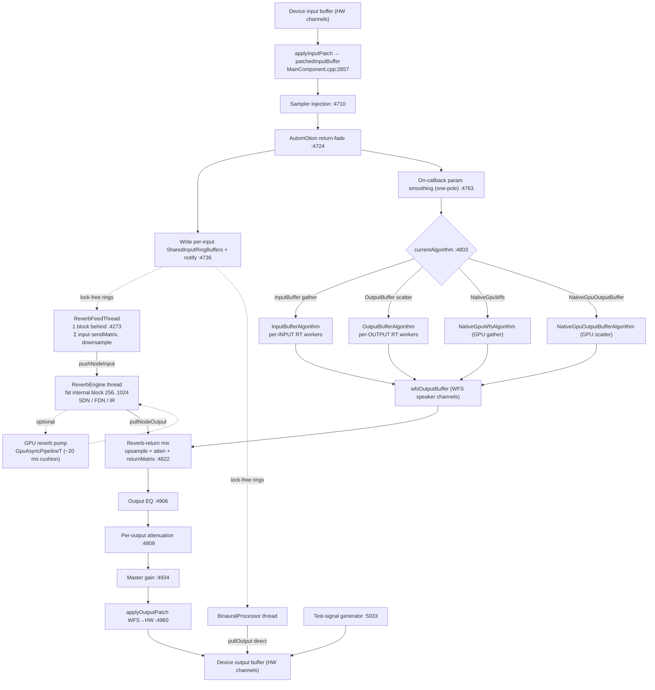

# WFS-DIY Audio Engine Map (CPU direct path + GPU fat-buffer path)

> **Status:** analysis-only. Nothing in WFS-DIY was modified to produce this document.
> **Method:** every factual claim cites `path:line`. Claims are tagged **[V]** (verified — the
> cited lines were opened and read, and in most cases independently re-checked by a second
> adversarial pass) or **[I]** (inferred — reasoned from surrounding code, not line-proven).
> Line numbers were accurate to within 1–2 lines across a full verification pass; where a
> range is given the quoted token sometimes sits at the last line of the range.
> **Placeholder:** the shared core library is referred to throughout as `spatcore`.

---

## 0. Reconciliation — where the brief's mental model diverges from the code

The task brief was written without intimate knowledge of the codebase. Several of its
landmarks are wrong or imprecise. Per instructions, the code wins and the differences are
flagged here up front, then substantiated in the relevant sections.

| Brief's landmark | Code reality | Where |
|---|---|---|
| "GPU renders latency-tolerant **SDN reverb** at fat buffers (a reverb sidecar)." | GPU has **five** kernel families (WFS gather, OutputBuffer scatter, IR convolution, FDN, SDN). A GPU **direct-path WFS renderer** and its OutputBuffer scatter dual already exist as selectable production algorithms. | §5, §2 |
| "**CUDA is the primary** backend; some HIP portability." | It is a **multi-vendor runtime plugin architecture** on Windows/Linux (`WFS_GPU_PLUGINS=1`): the CPU-safe app `LoadLibrary`s per-vendor plugins (`wfs_cuda`, `wfs_hip`) chosen at runtime; CUDA/HIP/Metal are complete parallel backends sharing one CUDA-C kernel *source string*. macOS is in-process Metal. | §5 |
| "CCD affinity pinning via `SetThreadAffinityMask` + runtime topology enumeration." | **Not implemented anywhere in `Source/`.** No `SetThreadAffinityMask` / topology enumeration in app code (only inside `ThirdParty/JUCE`). Windows RT = process-wide priority + throttling opt-out only. | §1 |
| "√(jω) / +3 dB-per-octave WFS prefilter (FIR or IIR)." | **Does not exist.** The only per-tap spectral shaping is a fixed **800 Hz high-shelf air-absorption biquad** (RBJ), plus an optional Floor-Reflection LowCut+HighShelf chain. No differentiator / +3 dB-per-octave field-correction filter. | §4 |
| "Double buffering." | More precisely a **depth-D primed-ring pipeline** (default D=4, range 1–16) with the pump doing a *synchronous* blocking GPU launch; overlap comes from the depth cushion, not stream ping-pong. | §3, §5 |
| "Validated rock-steady at 64 samples / 96 kHz on a 9950X." | Not asserted anywhere in source (it is a field/benchmark claim). The `64` in code is the OutputBuffer FR-diffusion sub-step; `256/96 kHz` is only an illustrative comment. | §3 |
| "32 SDN nodes, easy to bump." | 32 is confirmed but is a **hard** cap: baked into GPU kernel scratch `float incoming[32]` and several `std::array<…,MAX_NODES>` mirrors. Bumping it is *not* recompile-and-go. | §6 |
| "Max output 128, deliberately easy to bump." | True for audio (heap-sized), but a bump also enlarges fixed GUI arrays (`muteButtons[128]`) and does **not** move the hardcoded binaural literal `126`. | §6 |

---

## 1. Entry points & thread model

### 1.1 Process startup and the device callback

WFS-DIY is a **standalone `juce::AudioAppComponent`** (`MainComponent`), not a plugin
(`Source/MainComponent.h:98` **[V]**). There is **no custom `AudioIODeviceCallback`**; JUCE's
`AudioSourcePlayer`/device owns the callback thread, wired by `setAudioChannels()` inside
`attachAudioCallbacksIfNeeded()` (`Source/MainComponent.cpp:2455-2462` **[V]**). The device
(ASIO on Windows / CoreAudio on macOS / ALSA-JACK on Linux) drives:

```
MainComponent::getNextAudioBlock (Source/MainComponent.cpp:4671)   ← THE audio callback
MainComponent::prepareToPlay     (Source/MainComponent.cpp:4493)   ← re-prepare on device/SR/buffer change
MainComponent::releaseResources  (Source/MainComponent.cpp:5041)   ← teardown (joins reverb feed thread, 1000 ms)
```
**[V]** all three.

### 1.2 Real-time / near-real-time threads

| Thread | Created / elevated | Priority | Affinity | Talks to peers via | RT hazards |
|---|---|---|---|---|---|
| **Audio callback** (device-owned) | JUCE `setAudioChannels()` (`MainComponent.cpp:2455-2462`) | OS audio driver RT | none (see §1.4) | SPSC rings + atomics + `notify()` | see §1.3 |
| **WFS per-channel workers** — 1 `InputBufferProcessor` per *input* **or** 1 `OutputBufferProcessor` per *output* | `startRealtimeThread(RealtimeOptions{}.withApproximateAudioProcessingTime(blockSize, sr))` — `InputBufferAlgorithm.h:72-78`, `OutputBufferAlgorithm.h:239-245` | JUCE realtime | none | `SharedInputRingBuffer` / `LockFreeRingBuffer` + `notify()` | none on the worker loop; lock-free |
| **ReverbFeedThread** (1) | `MainComponent.cpp:4273-4274` | JUCE realtime | none | reads shared input rings; `SpinLock` snapshot of send matrix (`ReverbFeedThread.h:110-115`); `pushNodeInput` | brief SpinLock (near-RT, not callback); `wait(1)` 1 ms poll (`ReverbFeedThread.h:88-98`) |
| **ReverbEngine** (1, `juce::Thread`) | `ReverbEngine.h:153-158` | JUCE realtime | none | node SPSC rings; internally the fork-join calling thread | `AudioParallelFor` fork/join uses `std::mutex`+CV (`AudioParallelFor.h:120-136`) on *this* thread, not the callback |
| **AudioParallelFor pool** — up to 7 `std::thread` workers | `ReverbEngine.h:124-128` (`jlimit(0,7,hwThreads-2)`) | macOS: `THREAD_TIME_CONSTRAINT_POLICY` P-core (`RealtimeThreadUtil.h:30-58`); else default | none | atomic `fetch_add` work-steal + CV | mutex/CV at fork/join boundary |
| **GPU pump** — 1 `GpuAsyncPipelineT` per active GPU path (WFS-direct and each GPU reverb family have their own) | `GpuAsyncPipeline.h:111-113` | JUCE realtime | none | SPSC in/out rings; `wait(50)`+`notify()` | none on audio thread; the pump itself does a *blocking* GPU launch |
| **BinauralProcessor** (1) | `BinauralProcessor.h:171` | JUCE realtime | none | shared input rings | — |
| **Metering / analysis** (`InputAnalysisThread`, `OutputMeteringThread`) | `OutputBufferAlgorithm.h:248-255` | **`Priority::normal`** (not RT) | none | metering rings | cannot invert RT workers |
| **Message/timer thread** (JUCE) | — | normal | none | recomputes `target*` matrices (§1.3); 50 Hz calc-engine tick | not RT |
| **Network/tracking receivers** (OSC/PSN/RTTrP/MQTT, each a `juce::Thread`) | e.g. `OSCReceiverWithSenderIP.cpp:11-12` | normal | none | write positions into the ValueTree only | never touch audio buffers |

**[V]** for every row above.

Key structural fact: the two CPU WFS algorithms do the actual delay-and-sum on their **own
per-channel realtime worker threads** (`OutputBufferProcessor : juce::Thread`
`OutputBufferProcessor.h:25`; `InputBufferProcessor : juce::Thread` `InputBufferProcessor.h:24`)
**[V]**. The callback thread orchestrates and blends but does not itself run the per-tap DSP loop.

### 1.3 RT-path hazards (things that lock / allocate / syscall on or near the callback)

- **Heap alloc on the callback (size-change only).** `getNextAudioBlock` resizes
  `wfsOutputBuffer` via `setSize` when channel/sample count grows
  (`MainComponent.cpp:4793-4797` **[V]**), and `applyInputPatch` resizes `patchedInputBuffer`
  the same way (`MainComponent.cpp:2863-2867` **[V]**). At steady state (fixed block size)
  these do **not** reallocate; a first or larger block allocates on the callback thread.
- **Logging / OS query on the callback.** Every block queries `device->getXRunCount()` and, on
  change, calls `WFSLogger::logFromAudioThread(...)` (deferred/lock-free logger)
  (`MainComponent.cpp:4674-4681` **[V]**); plus `getMagnitude` per hardware channel for the
  input-presence meter (`MainComponent.cpp:4687-4701` **[V]**), before the DSP gate.
- **Unsynchronized cross-thread float matrices (benign race by design).**
  `targetDelayTimesMs / targetLevels / targetFRLevels` are plain `std::vector<float>` written
  by the message/timer thread (`MainComponent.cpp:3100-3103`, and `targetFRLevels` separately
  at `:5643`) and read+smoothed on the audio thread (`MainComponent.cpp:4768-4773`) with **no
  atomics or fence** **[V]**. Tolerated float tearing.
- **Solo-Reverbs clears direct sound on the callback** (`MainComponent.cpp:4826-4829` **[V]**).
- **The direct WFS callback path otherwise takes no locks** — patch remap, smoothing,
  reverb-return mix, EQ/attenuation/master gain all run on preallocated buffers using
  `juce::FloatVectorOperations`; the only synchronization is atomic loads and SPSC ring
  writes/`notify()` (`MainComponent.cpp:2857-2882, 4755-4759` **[V]**).
- **`ReverbFeedThread` SpinLock** snapshots the `(reverbLevels, stride, numRevs)` triplet once
  per batch; the per-sample summation uses only locals — a brief lock on a *near-RT* thread,
  not the callback (`ReverbFeedThread.h:110-115, 75-78` **[V]**).
- **Degenerate fork-join:** if `maxWorkers` computes to 0 (single reverb node, or
  `hwThreads<=2`), `AudioParallelFor` runs fully sequential on the reverb engine thread with no
  workers (`AudioParallelFor.h:107-112`, `ReverbEngine.h:125-126` **[V]**).

### 1.4 Realtime scheduling & affinity — the actual strategy (per platform)

- **Windows:** process-wide only — `SetPriorityClass(HIGH_PRIORITY_CLASS)`, EcoQoS / power-throttling
  opt-out via `SetProcessInformation(ProcessPowerThrottling)`, and `timeBeginPeriod(1)`
  (`Main.cpp:88-102` **[V]**). Per-thread elevation comes solely from JUCE `startRealtimeThread`.
  It is **not** `REALTIME_PRIORITY_CLASS` and there is **no core pinning**.
- **macOS:** `WindowUtils::beginRealtimeAudioActivity()` (App-Nap/timer-coalescing opt-out,
  `Main.cpp:116` **[V]**); DSP workers join the CoreAudio `os_workgroup` via
  `AudioWorkgroupCoordinator` (fast path = one atomic load per block, lock only on device/SR
  generation change — `AudioWorkgroupCoordinator.h:55-64`, republished from `prepareToPlay`
  `MainComponent.cpp:4504-4507` **[V]**); raw `std::thread` pool workers get a
  `THREAD_TIME_CONSTRAINT_POLICY` for P-core placement (`RealtimeThreadUtil.h:30-58` **[V]**).
- **Linux/Windows:** the workgroup coordinator and `RealtimeThreadUtil` helper are **no-ops**
  (`AudioWorkgroupCoordinator.h:20-23`, `RealtimeThreadUtil.h:55-58` **[V]**).

> **DIVERGENCE — CCD affinity pinning.** The brief's "`SetThreadAffinityMask` + runtime topology
> enumeration for the 9950X dual-CCD" is **not implemented in application code**. An independent
> grep for `SetThreadAffinityMask|GetLogicalProcessorInformation|SetThreadIdealProcessor|GROUP_AFFINITY`
> over `Source/` returns zero hits (matches exist only inside `ThirdParty/JUCE`). If the 9950X was
> "rock-steady," it was so under `HIGH_PRIORITY_CLASS` + JUCE realtime threads + the pipeline
> cushion, **without** any in-process core pinning. **[V]**

---

## 2. Dataflow

### 2.1 The audio callback, top to bottom

`getNextAudioBlock` (`MainComponent.cpp:4671`) executes this order when
`audioEngineStarted && processingEnabled` (`:4704`) **[V]**:

1. Xrun check + input-presence metering (`:4674-4701`).
2. **Input patch remap** hardware→WFS channels into `patchedInputBuffer` (`applyInputPatch`, `:4707` / `:2857-2882`).
3. **Sampler injection** overwrites active input channels (`:4710-4722`).
4. **AutomOtion return-fade** gain per input (`:4724-4734`).
5. **Shared-ring write + notify** — copy `patchedInputBuffer` into per-input `SharedInputRingBuffer`s and wake `ReverbFeedThread` / `BinauralProcessor` (`:4736-4761`). *This is where the reverb/binaural branch taps its input — before the WFS algorithm runs.*
6. **On-audio-thread parameter smoothing** — one-pole lerp of `delayTimesMs/levels/frLevels` toward `target*` (`:4763-4774`).
7. **WFS algorithm** writes `wfsOutputBuffer` (`:4803-4820`) — one of four (see §2.3).
8. **Reverb-return mix** — pull each node's wet output, upsample if `reverbSRRatio>1`, per-reverb attenuation, `addWithMultiply` into `wfsOutputBuffer` via the return-level matrix (`:4822-4903`).
9. **Per-output EQ** (`outputEQProcessor.processBlock`, `:4906`).
10. **Per-output attenuation** (`SmoothedValue`, `:4909-4930`).
11. **Master gain** (`SmoothedValue`, `:4934-4957`).
12. **Output patch remap** WFS→hardware, single pass (`applyOutputPatch`, `:4960`).
13. **Binaural pull** direct to hardware channels, bypassing the WFS→HW patch (`:4962-4973`).
14. **Test-signal injection** into the hardware buffer, independent of DSP (`:5033-5038`).

When the WFS engine is stopped, binaural can still run standalone (`:4977-5030`) **[V]**.

### 2.2 Diagram



> The reverb branch is **asynchronous**: the callback only writes shared rings and pulls node
> output; the feed sum and the SDN/FDN/IR processing happen on separate threads one-or-more
> blocks behind. The Mermaid dashed edges denote lock-free-ring hand-offs across threads.

### 2.3 The two CPU algorithms — gather vs. scatter (the key architectural split)

Both compute the same result (a delay-and-sum WFS field) but with opposite computational
graphs, selectable at runtime via `ProcessingAlgorithm` (`MainComponent.cpp:4803-4820` **[V]**):

- **InputBuffer = "gather"** (`InputBufferAlgorithm.h`, `InputBufferProcessor.h`). One RT worker
  **per input** owns a 1-second circular delay line; each output is formed by **reading** each
  input's delay line at a fractional past position and summing (`InputBufferProcessor.h:515-518`
  read-side linear interp) **[V]**. Output = Σ over inputs of `pullOutput` (`InputBufferAlgorithm.h:150-156` **[I/V]**).
- **OutputBuffer = "scatter"** (`OutputBufferAlgorithm.h`, `OutputBufferProcessor.h`). One RT
  worker **per output** owns a 1-second delay line; each input's contribution is **written**
  (scatter-add) into two adjacent delay cells with fractional weighting
  (`OutputBufferProcessor.h:522-524`) **[V]**, reading from the shared input rings at an
  independent per-output read cursor. Output sample = `delayData[wp] + frDelayData[wp]`, then
  that cell is zeroed (`OutputBufferProcessor.h:476-479` **[V]**).

Each processor carries a **parallel "FR" (Floor-Reflection) delay line** alongside the direct
one, with its own filters, level (`frLevels`) and a per-sample diffusion "grain"
(`OutputBufferProcessor.h:545-551` **[V]**). FR filtering happens *before* the delay write on the
input engine (`InputBufferProcessor.h:382-388`) but *at scatter time* on the output engine
(`OutputBufferProcessor.h:532-540`) **[V]**.

### 2.4 Control-rate parameter engine (WFSCalculationEngine) → the matrices

`WFSCalculationEngine` (`Source/DSP/WFSCalculationEngine.cpp/.h`) is **not** an audio-thread
component. It is a `juce::ValueTree::Listener` that, on a ~50 Hz timer, turns source/speaker
**geometry** into per-(input,output) parameter matrices under `matrixLock`
(`WFSCalculationEngine.cpp:1004-1042` **[V]**):

| Matrix (accessor) | Shape | Index | Meaning |
|---|---|---|---|
| `getDelayTimesMs()` | in×out | `in*numOut+out` | geometric delay (ms) = Δpath / 343 m·s⁻¹, clamped ≥0 (`WFSCalculationEngine.cpp:1234-1236`) |
| `getLevels()` | in×out | `in*numOut+out` | linear gain (distance law −20·log₁₀ or dB/m; ×Live-Source-Tamer gain) (`:1261-1262`) |
| `getHFAttenuationDb()` | in×out | `in*numOut+out` | air-damping dB → 800 Hz shelf gain (`:1290-1291`) |
| `getFRDelayTimesMs/FRLevels/FRHFAttenuationDb()` | in×out | `in*numOut+out` | Floor-Reflection parallel path (`WFSCalculationEngine.h:180-188`) |
| `getReverbOutputLevels()` | rev×out | `rev*numOut+out` | reverb-return mix matrix (used at `MainComponent.cpp:4834-4835,4893`) |
| (input→reverb send) | in×rev | `in*numRev+rev` | consumed by `ReverbFeedThread` (`ReverbFeedThread.h:154-162`) |

**[V]** for all. The engine computes into member arrays under `matrixLock`; the 50 Hz timer
copies them into `MainComponent`'s `target*` arrays; the audio thread one-pole-smooths those
into the arrays whose `.data()` pointers the processors actually read
(`MainComponent.cpp:4346-4353` prepare, `:4767-4772` smooth) **[V]**. This broker indirection is
what keeps the hot path decoupled from the ValueTree (see §7).

---

## 3. Buffering scheme & latency ledger

Three concurrent buffer domains, decoupled by lock-free rings **[V]**:

**(A) CPU direct WFS path** — processed in place at the **hardware block size**.
`prepareToPlay` forwards `samplesPerBlockExpected` verbatim to each algorithm's
`reprepare` (`MainComponent.cpp:4493, 4514` **[V]**). Adds **zero** intrinsic buffering latency:
one device block in, one out.

**(B) GPU direct WFS path** (when `NativeGpuWfs`/`NativeGpuOutputBuffer` selected) — inserts a
`GpuAsyncPipelineT` pump with per-channel SPSC in/out rings (`GpuAsyncPipeline.h`). Depth
**D = `gpuPipelineDepthDefault` = 4**, accepted range **1–8** at the caller and clamped 1–16 in
the pipeline (`WFSParameterDefaults.h:149-151`, `GpuAsyncPipeline.h:42-43` **[V]**). Added
latency **L = D·blockSize/sr** (`GpuAsyncPipeline.h:190` **[V]**). **This latency is compensated,
not reported:** the WFS backend **pre-subtracts** `latencyMs` from every delay-matrix entry and
clamps to `[0,maxDelay]` (`CudaWfsBackend.cpp:382-383`, computed at `NativeGpuWfsAlgorithm.h:77`
**[V]**), so arrival times for delays ≥ L are unchanged. Output rings are primed with D blocks of
silence (`GpuAsyncPipeline.h:100-103`); rings are sized `blockSize·(D+8)` (`:72` **[V]**).

**(C) Reverb wet-send path** — decoupled at three levels:
- `ReverbFeedThread` runs **one block behind** the callback (`ReverbFeedThread.h:13-14` **[V]**).
- `ReverbEngine` re-chunks device blocks into a **fat `internalBlockSize` = `jlimit(256,1024, samplesPerBlock/reverbSRRatio)`** (`ReverbEngine.h:80`; the device block is pre-divided by `reverbSRRatio` at `MainComponent.cpp:4591`) via per-node rings sized 32× (`ReverbEngine.h:84`), and pre-fills output rings with a **~16 ms silence cushion** (`ReverbEngine.h:104-110`) **[V]**.
- When the device SR is an integer multiple of 48 kHz the reverb runs at **48 kHz** (`reverbSRRatio` decimation, box-average down / linear-interp up on the callback) (`MainComponent.cpp:4581-4588, 4850-4858` **[V]**).
- The GPU reverb algorithms add a further `GpuAsyncPipelineT` pump sized for a **~20 ms cushion** (`kCushionMs=20.0`, depth = `ceil(20/blockMs)` clamped 1–16) (`ReverbSDNAlgorithmGPU.h:39, 82-86` **[V]**).

### 3.1 Latency ledger

| Stage | Adds | Reported? |
|---|---|---|
| CPU direct WFS (algorithm) | 0 (runs at HW block) | n/a |
| GPU direct WFS pump | **L = D·blockSize/sr** (D=4 default) | **Compensated** by pre-subtracting L from the delay matrix (`CudaWfsBackend.cpp:382-383`); nothing sent to a host |
| Reverb feed thread | 1 internal block behind | not reported (wet send) |
| Reverb re-chunk to fat internal block | up to `internalBlockSize` fill | not reported |
| Reverb output cushion | ~16 ms | not reported |
| GPU reverb pump | ~20 ms (`kCushionMs`) | exposed via `getPipelineLatencyMs()` for UI status (`ReverbEngine.h:945-955`), not host-reported |
| Reverb SR decimation (48 kHz) | box-avg down + linear-interp up | not reported |
| Master / output stages | 0 | n/a |

**No `setLatencySamples` / host latency reporting exists** — it is a standalone
`AudioAppComponent`, not a hosted plugin (`MainComponent.h:98` **[V]**; grep for
`setLatencySamples` = 0). The direct-GPU latency is delay-matrix-compensated; all reverb latency
is deliberately unreported wet-path pre-delay.

> **DIVERGENCE — "double buffering."** The GPU path is a **depth-D primed-ring lookahead
> pipeline**, not a strict 2-buffer flip; the pump performs a **synchronous** blocking launch
> (`cudaMemcpyAsync` up → kernels → async copy down → `cudaStreamSynchronize`,
> `CudaWfsBackend.cpp:490-491` **[V]**). Overlap/deadline isolation comes from the depth cushion,
> not from stream ping-pong. The same `GpuAsyncPipelineT` template serves both the direct-WFS and
> all GPU-reverb paths (`GpuAsyncPipeline.h`, `ReverbSDNAlgorithmGPU.h:180` **[V]**).

### 3.2 Ring buffers

- **`LockFreeRingBuffer`** (`Source/LockFreeRingBuffer.h`) — **SPSC**. Producer loads its own
  cursor `relaxed`, peer cursor `acquire`, publishes `release`; consumer mirrors; one slot kept
  empty to disambiguate full/empty (`:29-30, 56, 63-64, 136-139` **[V]**). No-arg
  `getAvailableData()` (used by GPU pump / reverb polling) loads both cursors `acquire`
  (`:97-98` **[V]**).
- **`SharedInputRingBuffer`** (`Source/DSP/SharedInputRingBuffer.h`) — **single-producer,
  multi-consumer**: producer publishes `writePos` `release`; each consumer passes its own read
  position by reference (`readWithPosition`) so consumers never share read state
  (`:44, 49-51, 64` **[V]**). Sized `blockSize·4` (`MainComponent.cpp:4253-4257`); `write()`
  caps at `bufferSize-1` with **no producer-side overflow counter** (`:32` **[V/I]**).
- Failure behaviour is non-blocking: `pullNodeOutput` zero-pads and increments `dropoutCount`
  on underrun (`ReverbEngine.h:213-219` **[V]**); GPU pump `popOutput` silence-fills and (when
  ready) increments `underrunCount` (`GpuAsyncPipeline.h:159-163` **[V]**).

---

## 4. DSP primitive inventory

The CPU DSP path is **hand-rolled per-sample**, not `juce::dsp`.

- **Fractional delay lines.** 1-second circular buffers (`delayBufferLength = sampleRate*1.0`),
  **linear (2-tap) interpolation only** — no cubic/Lagrange/allpass. Input engine reads
  fractionally (`InputBufferProcessor.h:515-518`); output engine scatter-writes into two adjacent
  cells (`OutputBufferProcessor.h:522-524`). Both taps modulo-wrapped (`InputBufferProcessor.h:511-512`).
  Coefficients computed, not tabulated. Delays clamped to buffer length. **[V]**
- **Prefilter — the headline divergence.** There is **no √(jω) / +3 dB-per-octave WFS
  field-correction filter (FIR or IIR) anywhere in `Source/`** (independently re-grepped: all
  "pre-filter" hits are the Floor-Reflection chain). The only per-tap spectral shaping is a
  **fixed 800 Hz high-shelf air-absorption biquad**, Q=0.3, RBJ Audio-EQ-Cookbook, one per
  (input,output) (`WFSHighShelfFilter.h:73-77`; applied `InputBufferProcessor.h:520-521`). Its
  gain is driven per-tap by `hfAttenuationDb` (air damping + directivity). **[V]**
- **Biquads** are all RBJ Direct-Form-I, processed per sample `b0·x+b1·x1+b2·x2−a1·y1−a2·y2`:
  `WFSBiquadFilter` (LowCut Butterworth Q=0.7071 / HighShelf, `WFSBiquadFilter.h:104,134`),
  `WFSHighShelfFilter` (fixed 800 Hz), `OutputEQBiquadFilter` (8 shapes,
  `OutputEQBiquadFilter.h:12-19`), `ReverbBiquadFilter` (6 shapes). **[V]**
- **Moving-source zipper avoidance — a layered chain (this is the answer to "how a moving
  source avoids clicks"):**
  1. **Position pre-smoothing:** `InputSpeedLimiter` (50 Hz tanh-deceleration speed cap,
     `InputSpeedLimiter.h:180-185`) and `TrackingPositionFilter` (1-Euro adaptive LP, Casiez
     2012, with velocity jump rejection, `TrackingPositionFilter.h:91-92, 271-272`). **[V]**
  2. **Matrix one-pole smoothing** of `delayTimesMs/levels/frLevels` on the audio thread
     (`MainComponent.cpp:4768-4773`). **[V]**
  3. **Per-sample C1 delay smoothing** inside each processor: `DelayTargetSmoother` — a ~10 ms
     causal box filter turning 50 Hz targets into C1-continuous per-sample delay
     (`DelayTargetSmoother.h`; window set `InputBufferProcessor.h:122-126`), plus a **teleport
     mute-move-unmute envelope** for jumps beyond `3·W` (`teleportThreshold_ = 3*windowSamples`,
     `DelayTargetSmoother.h:63`; envelope gain consumed at `InputBufferProcessor.h:523`). Two
     smoother banks per processor (direct + FR). **[V]**
  4. **Per-sample linear delay ramp** across the block (prev→curr, matching GPU semantics). **[V]**
- **Limiting / protection.** `LiveSourceTamerEngine` is a **control-rate (50 Hz)** per-speaker
  gain-reduction engine (distance/shape-curve, 500 ms ramp, `combinedAtten =
  fixedAttenLinear·peakGR·slowGR`, `LiveSourceTamerEngine.h:174-178`) — **not** a sample-accurate
  limiter. **There is no master brickwall limiter or soft-clip**; the output stage is only
  smoothed per-output attenuation + master gain before the HW patch (`MainComponent.cpp:4933-4957`). **[V]**
- **Denormals.** **No protection at all** — zero `ScopedNoDenormals`, no FTZ/DAZ, no
  `_controlfp`, no DC/noise injection (independently re-grepped = 0). `NumericGuards.h` only
  provides a NaN/Inf-tolerant `safeClamp` (`:22-27`). A real robustness gap given the many
  recursive biquads and feedback reverb. **[V]**
- **SIMD.** Essentially none in the hot path — delay/interp/biquad loops are scalar and rely on
  autovectorization (`OutputBufferProcessor.h:473-476`). `juce::FloatVectorOperations` is used
  only for reverb-return mixing and reverb wet/clear (`MainComponent.cpp:4884-4898`,
  `ReverbEngine.h:678-679`). No explicit intrinsics or `SIMDRegister`. **[V]**

---

## 5. GPU layer

### 5.1 Build gating & the true portability picture

Shipping builds define **`WFS_GPU_NATIVE=1`** on all desktop platforms and
**`WFS_GPU_PLUGINS=1`** on Windows and Linux (`WFS-DIY.jucer:525-559` **[V]**); macOS defines
`WFS_GPU_NATIVE=1` only (`:589-592`). Consequences:

- **Windows/Linux (WFS_GPU_PLUGINS=1):** the CPU-safe main app **loads per-vendor plugin
  shared libraries at runtime** through `GpuBackendFactory` → `PlatformDynLib`
  (`GpuBackendFactory.h:77-97`, `WfsGpuBackend.h:57-78`). Each plugin (`wfs_cuda`, `wfs_hip`)
  is built separately with its vendor toolkit (`tools/windows/build-gpu-plugins.ps1`,
  `tools/linux/build-gpu-plugins.sh`) and exports C creators
  `wfs_plugin_create_{wfs,ob,ir,fdn,sdn}` (`plugin/GpuVendorPlugin.cpp:40-58`). So the shipping
  app is a **runtime multi-vendor plugin host**, not a CUDA-only binary.
- **macOS (no plugins):** Metal is compiled **in-process** via the compile-time alias
  `using WfsGpuBackend = MetalWfsBackend` (`WfsGpuBackend.h:13-22`).
- **Inside a single plugin / the in-process path** the vendor *is* compile-time-fixed
  (`__APPLE__→Metal`, `WFS_GPU_HIP→HIP`, else CUDA) and the three backends never coexist in one
  translation unit — but the *app* can load several plugins and enumerate devices across them. **[V]**

> **DIVERGENCE — "CUDA primary; some HIP."** In reality CUDA, HIP and Metal are **complete
> parallel backends** for all five families (`Cuda*/Hip*/Metal*Backend`), and HIP/CUDA share the
> exact **CUDA-C kernel source string** (`HipWfsBackend.cpp:32` includes `CudaWfsKernels.h`,
> "the same CUDA-C source is valid HIP"), compiled at runtime via hipRTC. It is a deliberate
> multi-vendor architecture, not CUDA-with-HIP-bolted-on. **[V]**

### 5.2 Device enumeration & multi-GPU per-role selection

`GpuDeviceManager` (singleton, `GpuDeviceManager.h`) enumerates GPUs by `dlopen`/`LoadLibrary`
of the **vendor runtime DLLs the app never links** — HIP `amdhip64.dll`/`libamdhip64.so.6`,
CUDA via the **driver** lib `nvcuda.dll`/`libcuda.so.1` (`:117-142`). CPU is always pushed first
as the fallback (`:110`); ids are stable selector strings `cpu`/`cuda:1`/`hip:0`/`metal:0`;
name collisions get a ` #index` suffix (`:145-167`). **[V]**

Per-role selection is real and independent: the WFS/OB algorithm persists one
`ProcessingAlgorithmDevice` (`SystemConfigTab.h:558`), while the reverb engine keeps **three
separate** ids `irDeviceId/fdnDeviceId/sdnDeviceId` (`ReverbEngine.h:1113-1117`) — so WFS and
each reverb family can bind different GPUs. The CUDA DLLs are **delay-loaded** so a CPU-only /
AMD / Intel machine still launches (`CudaWfsBackend.cpp:46-57`). **[V]**

### 5.3 Kernel inventory (5 families) — one-line purpose each

Kernels live as `const char*` **string literals** in `Cuda*Kernels.h` and are compiled at
`prepare()` via **NVRTC/hipRTC** into PTX/code-object (no `.cu` build step); Metal `.mm` backends
compile MSL at prepare. CUDA is the validated reference; Metal is a hand-ported mirror
("keep the two in sync", `MetalWfsKernels.h:4-6`). **[V]**

| Family | Kernels | Purpose | Dispatch |
|---|---|---|---|
| **WFS (gather)** | `wfs_pairs`, `wfs_reduce` | per-(in,out) fractional-delay fetch + 800 Hz shelf IIR + accumulate direct+FR into scratch; then deterministic per-output sum (ascending order, no atomics, bit-reproducible) | `wfs_pairs` grid = pairGroups + 2·numIn; `wfs_reduce` grid = numOut (`CudaWfsKernels.h`, `CudaWfsBackend.cpp:457-488`) |
| **OutputBuffer (scatter)** | `ob_pairs`, `ob_reduce` | per-pair emit+clear accumulator cell, 800 Hz shelf, scatter-write to cell+d / cell+d+1 (d≥1 sample); then deterministic per-output reduce | `ob_pairs` grid = ceil(pairs/256); `ob_reduce` grid = numOut (`CudaObKernels.h`) |
| **IR reverb** | `ir_fdl_mac` | hybrid: host FFTs input/IR segments, kernel does frequency-domain complex MAC per (node, bin); host inverse-FFT + overlap-add | grid = numNodes, block = bins (`CudaIrKernels.h`, `IrConvHostState.h`, `IrHostFft.h`) |
| **FDN reverb** | `fdn_process` | one independent 16-line FDN per node: read taps → Walsh-Hadamard mix → per-line feedback allpass + 3-band decay → tone/DC filter | grid = numNodes, block = 16 threads (`CudaFdnKernels.h`, `FdnHostConfig.h`) |
| **SDN reverb** | `sdn_process` | one coupled scattering network: read all incoming paths (dual-tap crossfade on length change), Householder scatter `X=(2/(N-1))Σincoming`, write outgoing paths, 3-band decay + diffusion | grid = 1, block = numNodes threads (`CudaSdnKernels.h`, `SdnHostConfig.h`) |

**[V]** for all rows. The GPU direct-path WFS renderer (`NativeGpuWfsAlgorithm.h`) and its
OutputBuffer scatter dual (`NativeGpuOutputBufferAlgorithm.h`) are **working, production-gated
(`WFS_GPU_NATIVE=1`) drop-in algorithms** — a *fourth/third selectable algorithm beside the two
CPU ones — not scaffolding (`NativeGpuWfsAlgorithm.h:8` "Drop-in third algorithm beside the CPU
InputBuffer and OutputBuffer"; the WFS→HW matrix surface is identical). **[V]** The smoke test
`tools/test-gpu-plugin.cpp` exercises all five families in 7 scenarios (WFS 1×1, WFS 2→1, IR,
FDN, SDN, OB 1×1, OB 1→2). **[V]**

### 5.4 Device memory, transfer, scheduling

- **Persistent device state** stays resident across launches: WFS/OB rings + per-pair IIR
  `shelfState`; FDN `delayRings/diffRings/fbApRings` + write positions + filter state; SDN
  `delayLines[numPaths][8192]` (numPaths = N·(N−1)) + diffuser rings; IR `irSpectra` +
  per-node `inSpectra` ring. **[V]** OB's per-pair accumulator (`pairAcc`, ~1 s per pair) is the
  largest single allocation. **[V/I]**
- **Transfer:** pinned host staging (`cudaHostAlloc`/`hipHostMalloc`), one private stream per
  backend, `cudaMemcpyAsync` up → launch → async copy down → `cudaStreamSynchronize`
  (`CudaWfsBackend.cpp:269-271, 431-433, 490-491`). CUDA uses `cuDevicePrimaryCtxRetain` (shares
  the runtime's primary context); HIP just `hipSetDevice`; both rebind the device on the pump
  thread each `processBlock` because driver context currency is per-thread
  (`CudaWfsBackend.cpp:201-205, 366-372`, `HipWfsBackend.cpp:334-339`). **[V]**
- **Scheduling vs the callback:** the audio thread only `pushInput`/`popOutput` on lock-free
  rings and never blocks; the realtime **pump thread** performs the synchronous launch
  (`GpuAsyncPipeline.h:132-147, 209-211`). Prev→curr matrix double-buffering gives per-launch
  ramp continuity and is where the −L latency compensation is applied
  (`CudaWfsBackend.cpp:376-414`). **[V]**
- **No GPU present / failure:** `makeXBackend` returns nullptr → prepare returns false with
  "No GPU backend available (using CPU)" and the engine keeps the CPU path
  (`NativeGpuWfsAlgorithm.h:62-69`, `ReverbSDNAlgorithmGPU.h:64-68`); reverb records a
  `GpuFallback` status, or `GpuActive`+device name+latency on success (`ReverbEngine.h:945-955`).
  On Windows a plugin missing its `__declspec(dllexport)` markers, or a missing plugin file,
  silently falls back to CPU (`GpuVendorPlugin.cpp:26-35`; factory caches null on failure,
  `GpuBackendFactory.h:82-84`). **[V]**
- **WDDM mitigations:** none specific (no TDR/persistent-kernel/CUDA-graph handling). The only
  countermeasure is the architectural latency cushion, documented to absorb 3–5 ms desktop-
  compositor GPU-dispatch stalls (`GpuAsyncPipeline.h:21-25`); "persistent" in the code means
  persistent device *buffers* (`CudaSdnBackend.cpp:10`). **[V]**
- **Robustness gap:** if `backend->processBlock` returns false the pump sets `pumpFailed`,
  clears `readyFlag`, and **returns — the pump thread exits permanently**; thereafter
  `popOutput` silence-fills *without* counting underruns. A single hard launch failure silently
  and permanently drops the GPU path (`GpuAsyncPipeline.h:212-219`, `hasPumpFailed()` :187). **[V]**

---

## 6. Channel-count constants

Defined once as `constexpr int` in `Source/Parameters/WFSParameterDefaults.h`:
`maxInputChannels = 64` (L17), `maxOutputChannels = 128` (L18), `maxReverbChannels = 32` (L19). **[V]**

**Scales for free (heap-sized):** `WFSCalculationEngine` matrices (`std::vector`, sized
`numInputs*numOutputs`, `WFSCalculationEngine.cpp:13-56`); the `InputBuffer`/`OutputBuffer`
processors (sized by *actual* channel count, never referencing the max, `OutputBufferProcessor.h:46-55`);
`LiveSourceTamerEngine`/`InputSpeedLimiter` (heap resize, `MainComponent.cpp:1818-1830`);
ValueTree channels (one child per actual channel, clamped by `jlimit`,
`WFSValueTreeState.cpp:1384-1438`); MCP/OSC (max only as a JSON-schema bound); GPU level meters
(dynamic). **[V]**

**Hard costs when bumping (the "easy to bump" caveats):**
- **`maxReverbChannels` > 32 is a hard cap.** Baked into GPU kernel scratch
  `float incoming[32]` in **both** `CudaSdnKernels.h:93` and `MetalSdnKernels.h:120` (silent
  per-thread overflow if exceeded), plus `SdnHostConfig.h:36` `MAX_NODES=32` and
  `std::array<…,MAX_NODES>` mirrors in `ReverbSDNAlgorithm.h:544-545`, `ReverbPreProcessor.h:40`,
  `ReverbPostProcessor`. All must move in lockstep. SDN device cost is **quadratic**
  (`numPaths = N·(N−1)`, `SdnHostConfig.h:90-95`). **[V]**
- **`maxOutputChannels` bump enlarges fixed GUI arrays** `juce::TextButton muteButtons[128]`
  (`InputsTab.h:8183-8184`, `ReverbTab.h:5536`, `SetAllInputsWindow.h:792`) and does **not**
  move the hardcoded binaural literal `126` (`WFSParameterDefaults.h:52`). **[V]**
- **Stale comments** in `MainComponent.cpp:5615-5620, 5699-5703` call the stride
  "`maxOutputChannels (64)`" and "`maxReverbChannels (16)`" while the constants are 128 and 32;
  behaviour is correct (reads `getNumOutputs()/getNumReverbs()` at runtime) — misleading comments
  only, suggesting the constants were raised without updating comments. **[V]**

Net: **inputs 64 and outputs 128 are genuinely cheap to raise for audio** (heap-scaled), needing
only GUI-array + binaural-literal edits; **reverb 32 is a genuine hard limit** touching GPU
kernel source.

---

## 7. Coupling audit (extraction hazards)

The seam between audio-rate DSP and the app control plane is **remarkably clean**; hazards
concentrate in a handful of **control-rate** engines.

**Clean (CORE-ready) — no Parameters/Network/gui includes, no `juce::Component` reference:**
`LockFreeRingBuffer.h`, `SharedInputRingBuffer.h`, `DelayTargetSmoother.h` (only
cstdint/cmath/algorithm), all biquads, `NumericGuards.h`, `InputSpeedLimiter.h`,
`TrackingPositionFilter.h`, `InputBufferProcessor.h` / `OutputBufferProcessor.h` (take only
`const float*` matrix pointers + scalar setters, `InputBufferProcessor.h:27-42, 596-599`),
`ReverbEngine.h` (POD `AlgorithmParameters`/`NodePosition` structs + `std::string` deviceIds, no
ValueTree — the only `WFSParameterIDs` mention is a comment `:265`), `GpuAsyncPipeline.h`
(templated over any backend). **[V]**

**Deep welds (TANGLED) — take `WFSValueTreeState&` and are `juce::ValueTree::Listener`s at
control rate (50 Hz):**
- `WFSCalculationEngine` (`.h:29-41`, `addListener` `.cpp:70`) — includes `Parameters/`.
- `LiveSourceTamerEngine` (`.h:31-38`) — welded to **both** `WFSValueTreeState&` and
  `WFSCalculationEngine&`, and shares a **bare raw `const float*`** via `setLSGainsPtr`
  (`WFSCalculationEngine.h:194-197`, wired `MainComponent.cpp:1834`) with no ownership contract.
- `AutomOtionProcessor` — worst: includes `Parameters/WFSValueTreeState.h` **and**
  `Network/OSCProtocolTypes.h` (`.h:4-9`), a DSP-named class reaching into the network layer.
- `LFOProcessor`, `ClusterLFOProcessor`, `BinauralCalculationEngine` — same ValueTree-coupling class.

**[V]** all.

**The broker pattern that makes extraction feasible:** `MainComponent` owns the calc engines
*and* its own matrix arrays. The calc engine computes into member arrays under `matrixLock`
(`WFSCalculationEngine.cpp:1004-1042` — **seven** matrix families: delays/levels/HF, FR×3,
input→reverb, reverb-return→output), the 50 Hz timer copies them into `target*`, and the audio
thread one-pole-smooths into the arrays whose `.data()` the processors read. The audio thread
**never dereferences the calc engine's internals** — the app is the broker
(`MainComponent.cpp:4346-4353, 4767-4773`). The control plane funnels cleanly too: `OSCManager`
and MCP tools mutate only via `WFSValueTreeState::setInputParameter`
(`OSCManager.cpp:28-29,1786-1788`; `InputTools.h:174-176`). **[V]**

Extraction risk is therefore concentrated: pull the *math* out of the six control-rate engines
behind a param-snapshot seam; the hot-path primitives already have the clean pointer/POD contract.

---

## Appendix A — Success-criteria quick answers

- **Which files implement the delay lines?** `Source/DSP/InputBufferProcessor.h`
  (fractional-read/gather) and `Source/DSP/OutputBufferProcessor.h` (fractional-write/scatter) —
  1-second circular buffers, linear interpolation, each with a parallel FR line. The GPU duals are
  `NativeGpuWfsAlgorithm.h` + `Cuda/Metal WfsKernels.h` (device rings).
- **How does a moving source avoid zipper noise?** A four-layer chain: position pre-smoothing
  (`InputSpeedLimiter`, `TrackingPositionFilter`) → 50 Hz matrix one-pole
  (`MainComponent.cpp:4768-4773`) → per-sample C1 box smoother + teleport envelope
  (`DelayTargetSmoother`) → per-sample linear delay ramp across the block.
- **What happens to the GPU path on a machine with no CUDA?** `GpuDeviceManager` finds no CUDA
  device (driver DLL absent, delay-loaded), `makeXBackend` returns nullptr, prepare returns false
  with "No GPU backend available (using CPU)", and the engine transparently uses the CPU
  algorithm; reverb records a `GpuFallback` status. Nothing crashes; the app still launches.
